# Fl API Hub

[](https://flutter.dev)
[](https://dart.dev)
[](https://flutter.dev)

> 一站式 AI API 中转站管理工具，统一管理多平台账号、余额、密钥与自动签到

Fl API Hub 是一个跨平台 Flutter 应用，帮助 AI 开发者和中转站用户集中管理多个 API
中转站账号。告别分散的浏览器书签和手动签到，一切尽在掌控。

## ✨ 核心功能

- **账号聚合管理** - 统一添加、编辑、删除多个中转站账号，自动检测站点类型
- **余额实时监控** - 聚合仪表板展示总余额、今日消耗与收入，一目了然
- **API 密钥管理** - 集中管理各平台 API Key，支持快速导出与配置文件切换
- **快速签到** - 一键快速签到领取赠送额度，永不遗漏
- **数据备份** - JSON 导入导出，本地加密存储，数据安全有保障
- **Material Design 3** - 现代化 UI 设计，支持动态取色与深色模式

## 📸 应用截图

|                         桌面端（亮色）                         |                        桌面端（深色）                        |                        移动端（亮色）                         |                       移动端（深色）                        |
|:-------------------------------------------------------:|:-----------------------------------------------------:|:------------------------------------------------------:|:----------------------------------------------------:|
| 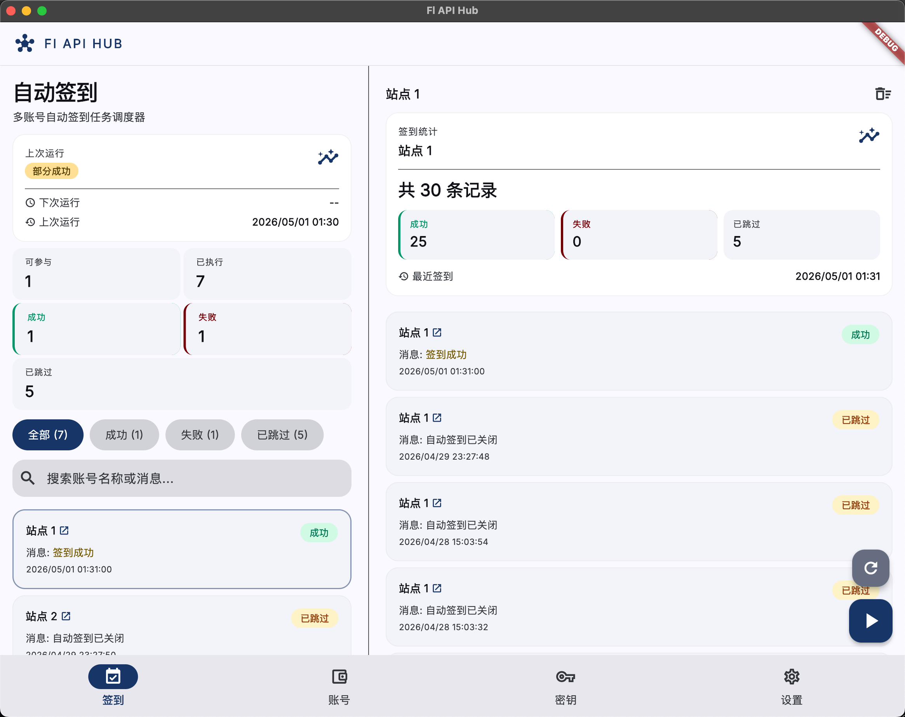 | 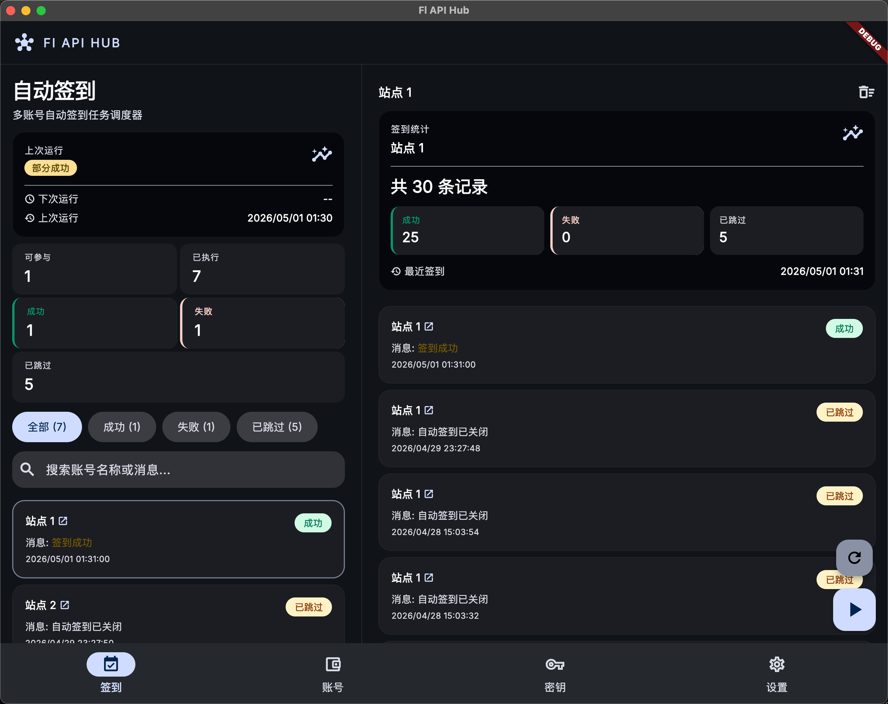 | 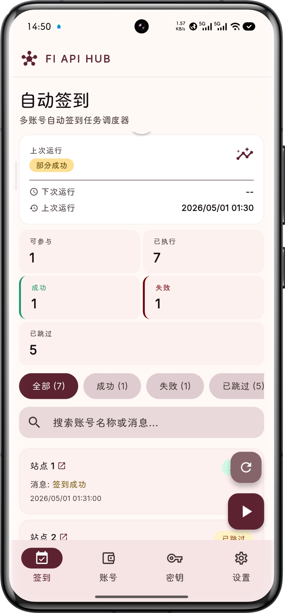 | 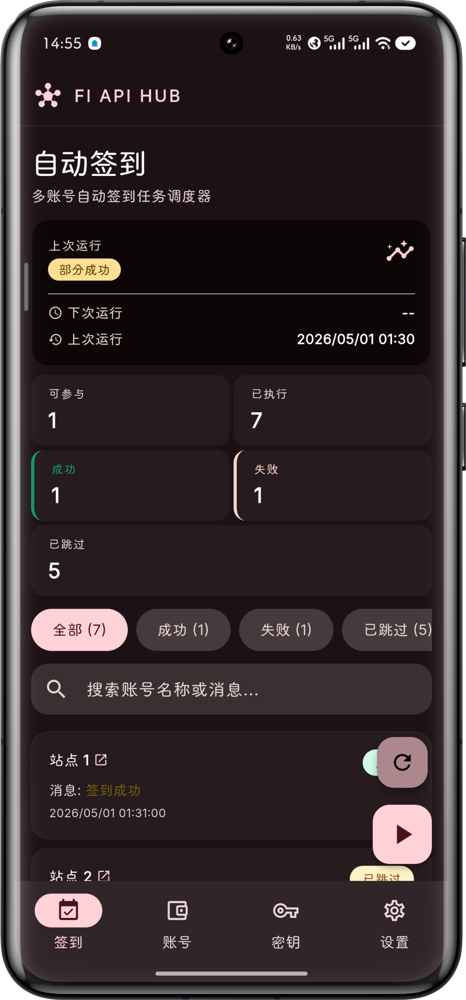 |

<details>
<summary>更多截图</summary>

### 桌面端

|                        账号管理                        |                      密钥管理                      |                        设置                        |
|:--------------------------------------------------:|:----------------------------------------------:|:------------------------------------------------:|
| 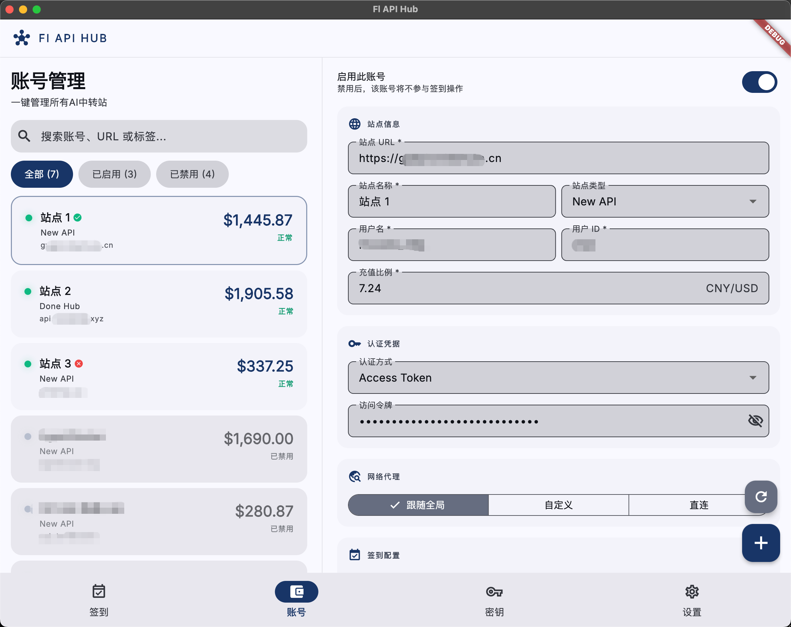 | 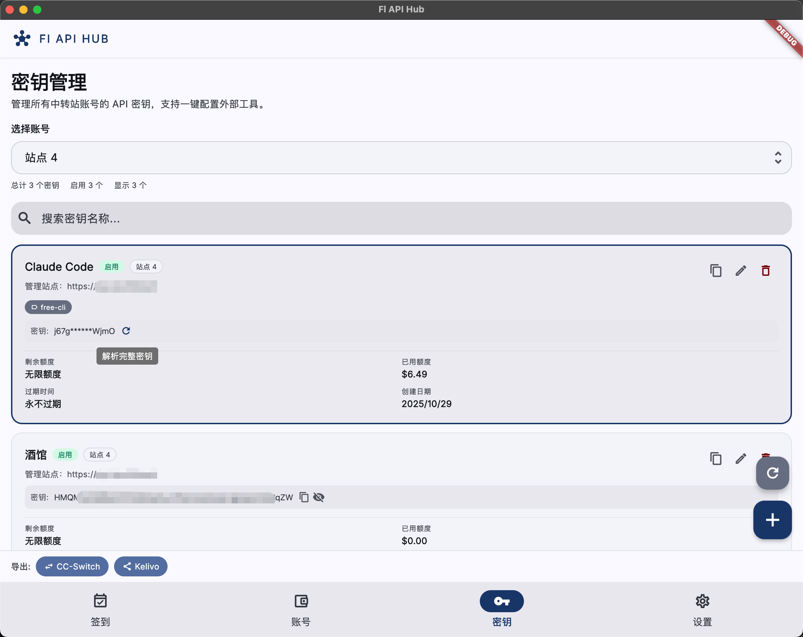 | 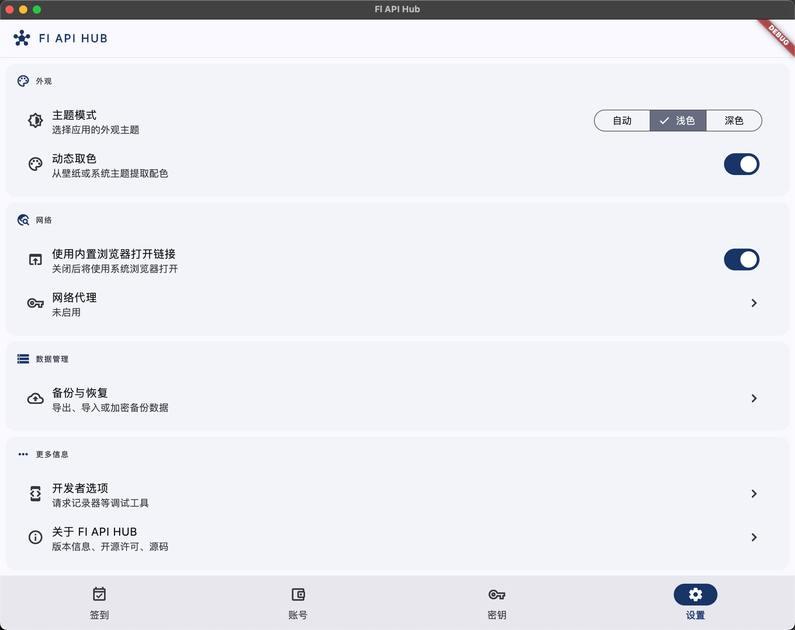 |

### 移动端

|                      签到记录                       |                    账号管理                    |                    密钥管理                    |                    设置                    |
|:-----------------------------------------------:|:------------------------------------------:|:------------------------------------------:|:----------------------------------------:|
| 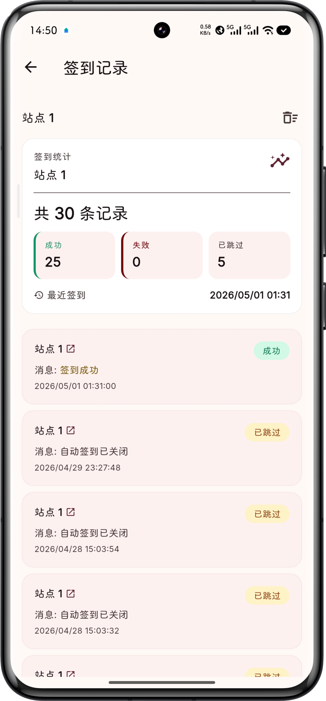 | 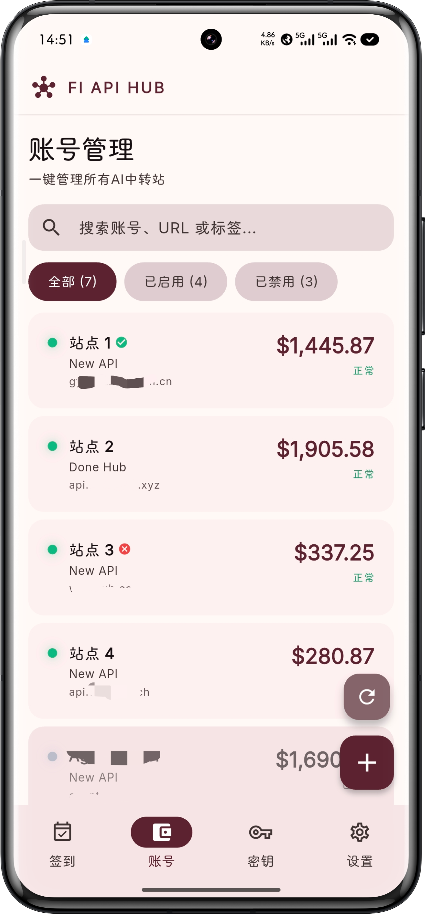 | 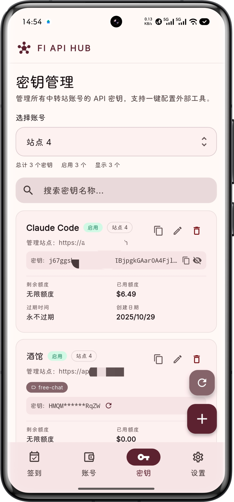 | 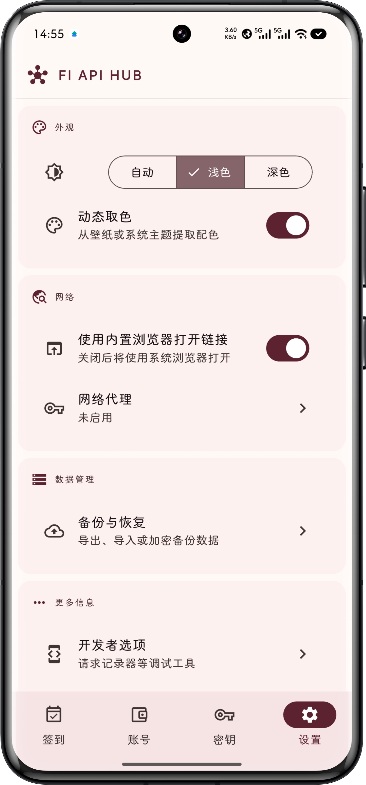 |

</details>

## 🏪 支持的平台

- New API
- One API
- Veloera
- One Hub
- Done Hub
- Octopus
- Sub2API

## 📱 支持的设备

| Android | iOS | macOS | Windows | Linux |
|:-------:|:---:|:-----:|:-------:|:-----:|
|    ✅    | 未测试 |   ✅   |   未测试   |  未测试  |

## 🚀 快速开始

### 环境要求

- Flutter SDK >= 3.10.4
- Dart SDK >= 3.10.4

### 安装依赖

```bash
flutter pub get
```

### 运行应用

```bash
# 开发模式
flutter run

# 指定平台
flutter run -d chrome    # Web
flutter run -d macos     # macOS
flutter run -d android   # Android
```

### 构建发布版本

```bash
flutter build apk       # Android APK
flutter build ios       # iOS (需要 Xcode)
flutter build web        # Web
flutter build macos      # macOS
```

## 📁 项目目录

```
lib/
├── app/                  # 应用配置（路由、主题、Shell）
├── core/                 # 核心模块
│   ├── network/          # Dio 客户端、站点适配器、代理配置
│   ├── storage/          # Hive 本地存储
│   ├── widgets/          # 通用 UI 组件
│   └── ...
└── features/             # 功能模块（按 Clean Architecture 组织）
    ├── accounts/         # 账号管理
    │   ├── data/         # 数据源、Repository 实现
    │   ├── domain/       # 实体、Repository 接口
    │   └── presentation/ # UI、Riverpod Providers
    ├── check_in/         # 签到功能
    ├── keys/             # 密钥管理
    ├── settings/         # 应用设置
    └── backup/           # 数据备份
```

## 🛠️ 技术栈

| 类别   | 技术                                 |
|------|------------------------------------|
| 框架   | Flutter 3 (Dart SDK ^3.10.4)       |
| 架构   | Clean Architecture + Feature First |
| 状态管理 | Riverpod                           |
| 网络层  | Dio + 站点适配器模式                      |
| 持久化  | Hive (结构化数据)                       |
| UI   | Material Design 3 + Dynamic Color  |
| 测试   | flutter_test + mocktail            |

## 🧪 测试

```bash
# 运行所有测试
flutter test

# 运行指定测试文件
flutter test test/widget_test.dart

# 生成覆盖率报告
flutter test --coverage
```

## 📝 代码规范

```bash
# 格式化代码
dart format .

# 静态分析
flutter analyze

# 自动修复 lint 问题
dart fix --apply
```

提交前请确保 `flutter analyze` 无警告。

## 📄 开源协议

本项目基于 [AGPL-3.0](LICENSE) 协议开源。

## 🙏 致谢

- 项目灵感来自 [qixing-jk/all-api-hub](https://github.com/qixing-jk/all-api-hub)
  ，感谢 [@qixing-jk](https://github.com/qixing-jk)
  的 [all-api-hub](https://github.com/qixing-jk/all-api-hub) 项目
- 感谢 [Linux.do 社区](https://linux.do/)

---

> 从浏览器扩展到原生应用，Fl API Hub 为你提供更好的中转站管理体验。
