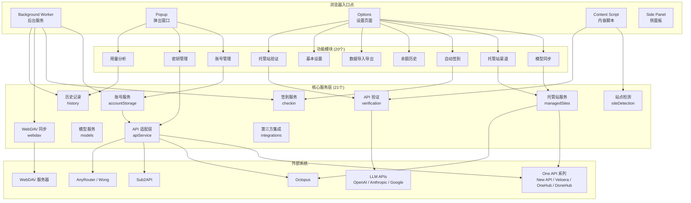
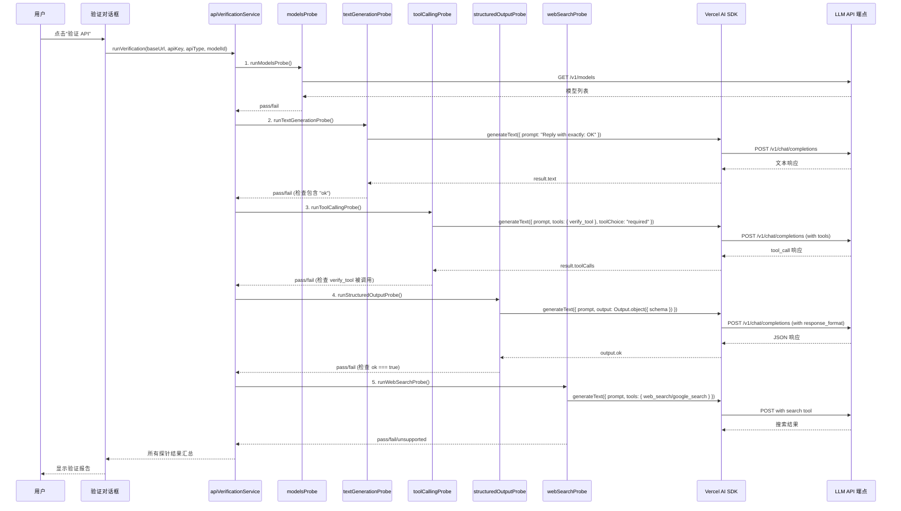
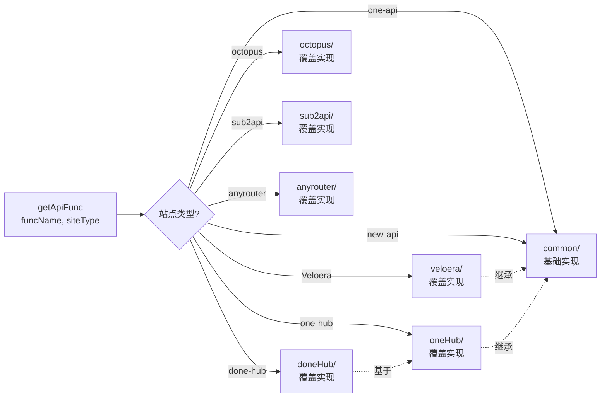

# All API Hub 大模型应用分析报告

> 本报告由 project-analyzer skill 自动生成
> 生成时间: 2026-03-22T12:00:00+08:00
> 关联索引: [translated_prompts/INDEX.md](./translated_prompts/INDEX.md)

---

## 1. 项目概述

- **项目名称**: All API Hub（中转站管理器）
- **项目版本**: 3.29.0
- **项目描述**: 一站式浏览器扩展，用于管理多个 AI API 中转站（One API、New API、Veloera、OneHub、DoneHub、Octopus、AnyRouter、Sub2API 等）的账号，集中管理余额、用量、密钥、模型同步和自动签到等功能。
- **主要功能**:
  - 账号发现与站点类型自动检测
  - 余额、额度、用量和令牌管理
  - 模型同步与托管站点渠道管理
  - 自动签到、WebDAV 云同步
  - Popup、Options 页面、侧面板多入口 UI
  - AI API 端点能力验证（文本生成、工具调用、结构化输出、网页搜索）
  - 第三方工具集成（Cherry Studio、Claude Code、Kilo Code 等）
- **技术栈**:
  - 框架: WXT (WebExtension Toolkit)
  - UI: React 19 + TypeScript
  - 样式: Tailwind CSS 4 + Headless UI + Radix UI + Base UI
  - 状态管理: React Context + TanStack Query
  - 存储: @plasmohq/storage
  - AI SDK: Vercel AI SDK（用于 API 验证）
  - 测试: Vitest + Testing Library + MSW + Playwright
- **代码规模**: ~125,000 行，832 个源文件
- **支持浏览器**: Chrome/Chromium (MV3)、Firefox (MV2)、Edge、Android Firefox
- **国际化**: 简体中文、繁体中文、英文、日文

---

## 2. 提示词统计（与 INDEX.md 一致）

**数据来源**: 本统计数据与 `translated_prompts/INDEX.md` 完全一致

### 2.1 总体统计

| 统计项 | 数量 | 来源验证 |
|--------|------|----------|
| 总提示词数量 | 5 | ✅ 与 INDEX.md 一致 |
| 系统提示词 | 0 | ✅ 与 INDEX.md 一致 |
| 用户提示词 | 5 | ✅ 与 INDEX.md 一致 |
| 任务提示词 | 0 | ✅ 与 INDEX.md 一致 |
| 工具提示词 | 0 | ✅ 与 INDEX.md 一致 |

### 2.2 分类详情

#### 用户提示词 (5个)

| 序号 | 名称 | 原文件位置 | 功能简述 |
|------|------|-----------|----------|
| 1 | text_generation_probe_prompt | `probes/textGenerationProbe.ts:28` | API 验证 - 基础文本生成探针 |
| 2 | tool_calling_probe_prompt | `probes/toolCallingProbe.ts:43` | API 验证 - 工具调用探针 |
| 3 | structured_output_probe_prompt | `probes/structuredOutputProbe.ts:36` | API 验证 - 结构化输出探针 |
| 4 | web_search_openai_probe_prompt | `probes/webSearchProbe.ts:49` | API 验证 - 网页搜索探针（OpenAI） |
| 5 | web_search_google_probe_prompt | `probes/webSearchProbe.ts:96` | API 验证 - 网页搜索探针（Google） |

> 注：所有提示词均位于 `src/services/verification/aiApiVerification/probes/` 目录下

---

## 3. 项目逻辑与数据流分析

### 3.1 整体架构数据流

### 3.2 API 验证流程（大模型调用链路）

### 3.3 站点覆盖模式数据流

---

## 4. 大模型应用场景分析

### 场景 1: API 端点基础验证 - 文本生成

- **触发条件**: 用户在"验证 API"对话框中点击验证按钮
- **使用的提示词**: [text_generation_probe_prompt](./translated_prompts/text_generation_probe_prompt_zh.md)
- **提示词来源**: INDEX.md 第 1 个提示词
- **代码位置**: `src/services/verification/aiApiVerification/probes/textGenerationProbe.ts:28`
- **输入输出**:
  - 输入: baseUrl + apiKey + apiType + modelId + 固定提示词
  - 输出: `ApiVerificationProbeResult { status: "pass" | "fail", latencyMs, summary }`
- **作用**: 测试 LLM API 端点是否能正常响应基础文本生成请求，作为最基础的可用性验证

### 场景 2: API 端点能力验证 - 工具调用

- **触发条件**: 文本生成探针通过后自动触发
- **使用的提示词**: [tool_calling_probe_prompt](./translated_prompts/tool_calling_probe_prompt_zh.md)
- **提示词来源**: INDEX.md 第 2 个提示词
- **代码位置**: `src/services/verification/aiApiVerification/probes/toolCallingProbe.ts:43`
- **输入输出**:
  - 输入: baseUrl + apiKey + apiType + modelId + 提示词 + verify_tool 工具定义
  - 输出: `ApiVerificationProbeResult` + toolCalls/toolResults 详情
- **作用**: 测试 LLM 是否支持 Function Calling / Tool Use 能力

### 场景 3: API 端点能力验证 - 结构化输出

- **触发条件**: 工具调用探针完成后自动触发
- **使用的提示词**: [structured_output_probe_prompt](./translated_prompts/structured_output_probe_prompt_zh.md)
- **提示词来源**: INDEX.md 第 3 个提示词
- **代码位置**: `src/services/verification/aiApiVerification/probes/structuredOutputProbe.ts:36`
- **输入输出**:
  - 输入: baseUrl + apiKey + apiType + modelId + 提示词 + Zod Schema
  - 输出: `ApiVerificationProbeResult` + 解析后的 JSON 对象
- **作用**: 测试 LLM 是否支持 JSON Mode / Structured Output 能力

### 场景 4: API 端点能力验证 - 网页搜索（OpenAI）

- **触发条件**: 结构化输出探针完成后，且 apiType 为 "openai" 时自动触发
- **使用的提示词**: [web_search_openai_probe_prompt](./translated_prompts/web_search_openai_probe_prompt_zh.md)
- **提示词来源**: INDEX.md 第 4 个提示词
- **代码位置**: `src/services/verification/aiApiVerification/probes/webSearchProbe.ts:49`
- **输入输出**:
  - 输入: baseUrl + apiKey + modelId + 提示词 + web_search 工具配置
  - 输出: `ApiVerificationProbeResult` + sources 列表
- **作用**: 测试 OpenAI 兼容 API 是否支持实时网页搜索功能

### 场景 5: API 端点能力验证 - 网页搜索（Google）

- **触发条件**: 结构化输出探针完成后，且 apiType 为 "google" 时自动触发
- **使用的提示词**: [web_search_google_probe_prompt](./translated_prompts/web_search_google_probe_prompt_zh.md)
- **提示词来源**: INDEX.md 第 5 个提示词
- **代码位置**: `src/services/verification/aiApiVerification/probes/webSearchProbe.ts:96`
- **输入输出**:
  - 输入: baseUrl + apiKey + modelId + 提示词 + google_search 工具配置
  - 输出: `ApiVerificationProbeResult` + sources 列表
- **作用**: 测试 Google Gemini API 是否支持 Search Grounding 功能

---

## 5. 上下文工程

### 5.1 Agent 循环分析

本项目**不包含 Agent 循环模式**。所有 LLM 调用均为单次请求-响应模式，用于功能探测，不涉及多轮对话、规划-执行循环或反思机制。

### 5.2 工具清单

| 工具名称 | 描述 | 参数 Schema | 使用场景 | 关联提示词 |
|---------|------|------------|----------|-----------|
| verify_tool | 返回时间戳字符串 | `{ type: "object", properties: {} }` | 工具调用探针测试 | tool_calling_probe_prompt |
| web_search (OpenAI) | OpenAI 内置网页搜索工具 | `{ externalWebAccess: true, searchContextSize: "low" }` | OpenAI API 网页搜索探测 | web_search_openai_probe_prompt |
| google_search (Google) | Google Gemini 内置搜索 Grounding 工具 | `{}` | Google API 搜索探测 | web_search_google_probe_prompt |

### 5.3 大模型嵌入型分析

本项目的大模型调用属于**验证型嵌入**，而非业务型嵌入：

- **前序流程**: 用户配置 API 端点信息 → 选择验证 → 依次执行 5 个探针
- **上下文提供方式**: 每个探针独立构造固定提示词，不依赖外部上下文或 RAG 检索
- **模型输出用途**: 仅用于判断 API 能力支持情况（pass/fail/unsupported），不影响核心业务逻辑
- **涉及的提示词**: 全部 5 个（INDEX.md 中的第 1-5 个）

---

## 6. 数据一致性声明

本报告中的提示词统计数据：
- AI_MODEL_USAGE_ANALYSIS.md 记录总数: 5
- translated_prompts/INDEX.md 记录总数: 5
- translated_prompts/ 目录实际文件数: 5

**三者一致性检查**: ✅ 通过

生成时间: 2026-03-22T12:00:00+08:00
