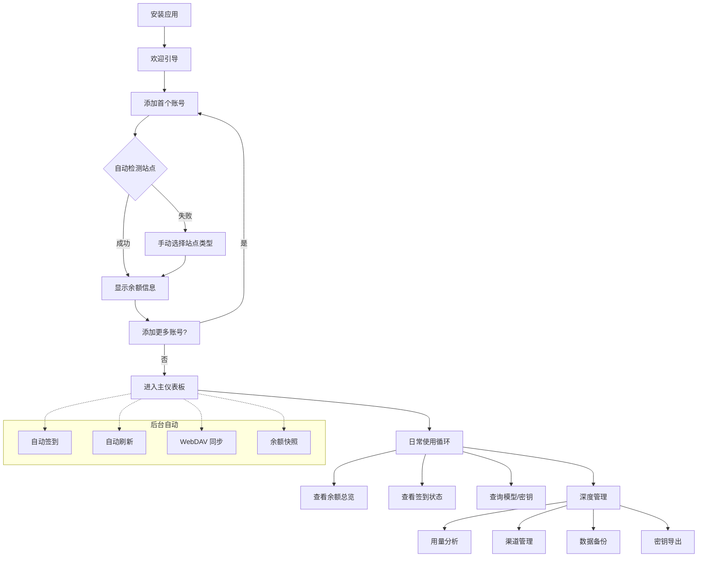
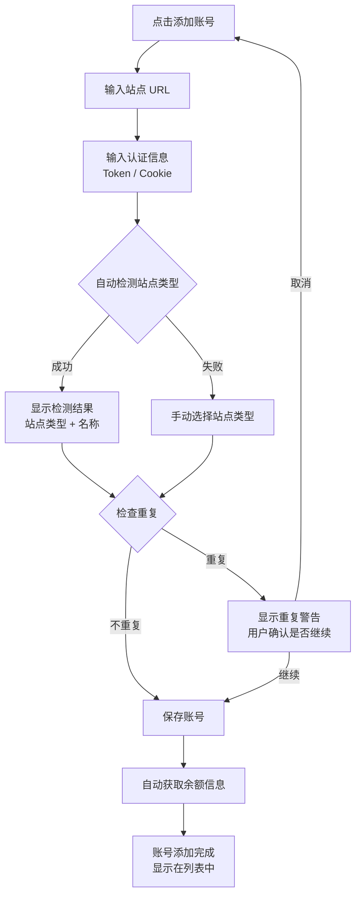
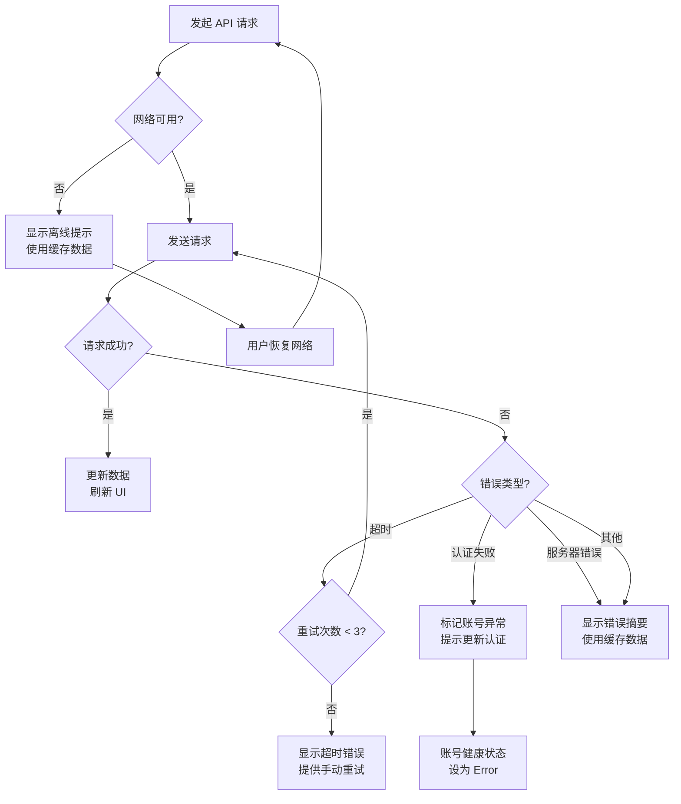

# All API Hub - 产品需求文档 (PRD)

> **文档版本**: 1.0
> **生成时间**: 2026-03-22
> **产品类型**: 传统应用（含轻量 AI 验证功能）
> **目标平台**: Flutter（从 Chrome 浏览器扩展迁移）
> **原始技术栈**: WXT + React 19 + TypeScript + Tailwind CSS 4
> **关联分析报告**: [AI_MODEL_USAGE_ANALYSIS.md](../AI_MODEL_USAGE_ANALYSIS.md)

---

## 目录

1. [需求背景](#1-需求背景)
2. [产品定位](#2-产品定位)
3. [用户故事](#3-用户故事)
4. [用户旅程](#4-用户旅程)
5. [功能清单](#5-功能清单)
6. [AI API 验证功能](#6-ai-api-验证功能)
7. [非功能性需求](#7-非功能性需求)
8. [异常处理](#8-异常处理)
9. [测试标准](#9-测试标准)
10. [迭代规划](#10-迭代规划)
11. [附录](#11-附录)

---

## 1. 需求背景

### 1.1 行业背景

随着大语言模型（LLM）的广泛应用，出现了大量 AI API 中转站/代理平台（如 One API、New
API、Veloera、OneHub、DoneHub、Octopus 等）。这些平台提供统一的 OpenAI 兼容接口，允许用户通过单一 API
密钥访问多个 LLM 提供商的模型。

用户通常会在多个中转站开设账号以获取更好的价格、更高的可用性和更多的模型选择。然而，跨平台管理这些账号变得越来越困难：

- **余额监控困难**：需要逐个登录不同平台查看余额和用量
- **密钥管理混乱**：多个平台的 API 密钥难以统一管理和快速导出
- **签到遗忘**：部分平台提供每日签到赠送额度，但手动签到容易遗忘
- **模型信息分散**：不同平台支持的模型列表和定价需要逐一查询
- **数据备份风险**：各平台配置信息分散在不同浏览器 Cookie 中

### 1.2 产品起源

All API Hub 起源于一个 Chrome 浏览器扩展，已迭代至 v3.29.0，拥有约 125,000 行 TypeScript 代码。产品已覆盖
Chrome、Firefox、Edge 及 Android Firefox 平台。

### 1.3 Flutter 迁移动机

将产品从浏览器扩展迁移到 Flutter 应用的主要动机：

| 动机             | 说明                                          |
|----------------|---------------------------------------------|
| **跨平台覆盖**      | 从浏览器扩展扩展到 iOS/Android 原生应用和桌面端              |
| **更丰富的 UI 能力** | 浏览器扩展 Popup 空间受限（≤600px 高度），Flutter 可实现全屏体验 |
| **离线能力增强**     | 脱离浏览器运行，支持更强的后台任务和本地通知                      |
| **用户体验提升**     | 原生渲染性能优于 Web，动画和手势交互更流畅                     |
| **分发渠道扩展**     | 可通过 App Store / Google Play 分发，降低安装门槛       |

### 1.4 迁移挑战

| 挑战                | 原始方案                                              | Flutter 替代方案                                                 |
|-------------------|---------------------------------------------------|--------------------------------------------------------------|
| 浏览器 API 访问        | `chrome.tabs`, `chrome.cookies`, `chrome.storage` | HTTP 请求直连 + 本地安全存储                                           |
| Background Worker | Service Worker 持续运行                               | Dart Isolate + WorkManager (Android) / BGTaskScheduler (iOS) |
| Content Script    | 注入网页 DOM                                          | 不适用，改为独立 API 调用                                              |
| 临时窗口/Shield 绕过    | 创建隐身标签页执行 JS                                      | WebView 组件或放弃此功能                                             |
| Cookie 认证         | `chrome.cookies` API                              | `dart:io` HttpClient 管理 Cookie                               |
| 扩展存储              | `@plasmohq/storage` (chrome.storage)              | `shared_preferences` / `hive` / `drift`                      |
| 右键菜单/兑换助手         | Content Script 注入                                 | 不适用，改为应用内操作                                                  |

---

## 2. 产品定位

### 2.1 产品愿景

**All API Hub** 旨在成为 AI API 中转站用户的**一站式管理中心**，让用户在一个应用内完成所有中转站账号的查看、管理和运维操作。

### 2.2 目标用户

| 用户角色        | 描述                  | 核心需求               |
|-------------|---------------------|--------------------|
| **AI 开发者**  | 使用多个 API 中转站进行开发测试  | 密钥管理、模型查询、成本分析     |
| **AI 重度用户** | 日常使用 AI 助手，需要管理多个订阅 | 余额监控、自动签到、省钱优化     |
| **中转站运营者**  | 运营自己的 API 中转站服务     | 渠道管理、模型同步、站点后台联动   |
| **团队管理员**   | 为团队管理 AI API 资源分配   | 用量分析、API 凭证管理、数据导出 |

### 2.3 核心价值主张

1. **集中管理** — 一个应用管理所有 AI API 中转站账号
2. **实时监控** — 余额、用量、健康状态一目了然
3. **自动运维** — 自动签到、自动刷新、自动备份
4. **深度分析** — 多维度用量分析和成本优化建议
5. **隐私优先** — 所有数据本地存储，不上传第三方服务器

### 2.4 竞品对比

| 特性      | All API Hub                           | 手动登录管理       | 第三方 API 管理工具 |
|---------|---------------------------------------|--------------|--------------|
| 多平台账号聚合 | ✅ 13+ 站点类型                            | ❌ 逐个登录       | ⚠️ 通常仅支持主流平台 |
| 自动签到    | ✅ 内置                                  | ❌ 手动         | ❌ 无          |
| 用量分析    | ✅ 多维度图表                               | ⚠️ 平台自带基础统计  | ⚠️ 有限        |
| 密钥导出集成  | ✅ Cherry Studio/Claude Code/Kilo Code | ❌ 手动复制       | ❌ 无          |
| 站点后台管理  | ✅ 渠道/模型同步                             | ✅ 原生后台       | ❌ 无          |
| 本地隐私    | ✅ 全部本地存储                              | ❌ 浏览器 Cookie | ⚠️ 可能上传      |

---

## 3. 用户故事

### 3.1 账号管理模块

#### 用户故事

:::info
**作为** AI 开发者
**我希望** 在一个界面中添加和管理我所有 AI API 中转站的账号
**以便于** 快速查看每个账号的余额、用量和健康状态，不再需要逐个登录各平台
:::

#### 验收标准

- 支持添加至少 13 种站点类型的账号（One API、New API、Veloera、OneHub、DoneHub、Octopus、AnyRouter、Sub2API
  等）
- 添加账号时自动检测站点类型和基础信息
- 账号列表按余额/消耗/收入/名称排序
- 支持标签系统对账号进行分类管理
- 支持禁用账号（不参与自动操作）和从总余额中排除
- 支持手动和自动刷新账号数据

#### 技术实现

- API 适配层通过 `getApiFunc(funcName, siteType)` 动态选择站点实现
- 账号数据存储在本地（Flutter 侧使用 Hive/Drift）
- 站点检测通过 HTTP 请求分析响应特征实现

---

### 3.2 余额监控与历史模块

#### 用户故事

:::info
**作为** AI 重度用户
**我希望** 实时查看所有账号的余额总览和历史趋势
**以便于** 及时发现余额不足的账号并做出充值决策
:::

#### 验收标准

- Popup/主页面显示所有账号的聚合余额（支持 USD/CNY 切换）
- 支持每日余额快照和历史趋势图
- 支持按账号、标签、时间范围筛选
- 显示收入（签到/充值）和支出（消耗）明细
- 支持固定重要账号到顶部

#### 技术实现

- 每日余额快照通过后台定时任务采集
- 历史数据存储在本地数据库中
- 图表使用 fl_chart 或 syncfusion_flutter_charts 渲染

---

### 3.3 自动签到模块

#### 用户故事

:::info
**作为** 拥有多个中转站账号的用户
**我希望** 应用能自动帮我完成每日签到领取免费额度
**以便于** 不再因为忘记签到而浪费免费额度
:::

#### 验收标准

- 支持全局启用/禁用自动签到
- 支持按账号单独启用/禁用
- 支持设置签到时间窗口和重试策略
- 签到完成后推送通知
- 显示签到历史和成功/失败状态
- 支持外部 URL 签到和自定义签到链接

#### 技术实现

- 使用 WorkManager (Android) / BGTaskScheduler (iOS) 实现后台定时任务
- 签到通过模拟 HTTP 请求完成
- 签到状态按 YYYY-MM-DD 日期重置防止重复

---

### 3.4 密钥管理模块

#### 用户故事

:::info
**作为** AI 开发者
**我希望** 在一个界面集中查看、创建、编辑和导出所有账号的 API 密钥
**以便于** 快速获取所需密钥并配置到开发环境中
:::

#### 验收标准

- 按账号聚合展示密钥列表
- 支持密钥的显示/隐藏切换
- 支持创建、编辑、删除密钥
- 支持一键导出到 Cherry Studio、Claude Code、Kilo Code 等工具
- 支持密钥权限和过期时间追踪
- 支持搜索和过滤密钥

#### 技术实现

- 密钥通过各站点 API 获取
- 敏感数据使用 flutter_secure_storage 加密存储
- 导出功能生成符合目标工具格式的配置文件

---

### 3.5 模型列表模块

#### 用户故事

:::info
**作为** AI 开发者
**我希望** 查看所有账号支持的模型列表及其定价信息
**以便于** 选择最具性价比的模型和平台组合
:::

#### 验收标准

- 聚合展示所有账号的模型列表
- 显示模型定价（Prompt/Completion Token 价格）
- 支持按供应商、模型类型分组过滤
- 支持 USD/CNY 价格换算
- 支持 API 可用性验证和 CLI 兼容性测试

#### 技术实现

- 模型数据从各账号 API 获取并聚合
- 价格信息支持从 All API Hub 元数据服务补充
- 使用缓存减少重复请求

---

### 3.6 用量分析模块

#### 用户故事

:::info
**作为** 团队管理员
**我希望** 查看详细的 API 用量统计和成本分析报告
**以便于** 优化团队的 AI API 使用策略和预算分配
:::

#### 验收标准

- 支持按日/周/月的用量趋势图
- 支持按模型、账号、Token 的多维度分析
- 显示成本分布和排行榜
- 提供延迟分析和慢模型/慢Token 识别
- 支持使用时间热力图
- 支持数据导出

#### 技术实现

- 用量数据增量同步，基于 `created_at` 和指纹去重
- 多维度聚合存储（daily, hourly, dailyByModel, dailyByToken 等）
- 使用 ECharts for Flutter 或 fl_chart 渲染图表

---

### 3.7 数据备份与同步模块

#### 用户故事

:::info
**作为** 在多台设备上使用的用户
**我希望** 能自动备份我的数据到 WebDAV 服务器并在设备间同步
**以便于** 在更换设备或重装时快速恢复所有配置
:::

#### 验收标准

- 支持手动导入/导出 JSON 格式数据
- 支持 WebDAV 备份/恢复
- 支持自动定时同步
- 支持备份数据加密（AES）
- 支持选择性同步（账号、偏好、用量历史、余额历史）
- 同步冲突时支持智能合并

#### 技术实现

- WebDAV 使用 webdav_client 包
- 加密使用 encrypt / pointycastle 包
- 智能合并基于时间戳和 ID 匹配

---

### 3.8 渠道管理与模型同步模块（托管站点）

#### 用户故事

:::info
**作为** 中转站运营者
**我希望** 在应用内直接管理我的中转站渠道配置和模型同步
**以便于** 不需要打开站点后台即可完成日常运维操作
:::

#### 验收标准

- 支持 New API、Veloera、DoneHub、Octopus 四种托管站点类型
- 支持渠道的创建、编辑、删除、启用/禁用
- 支持模型列表同步（全量/增量）
- 支持批量操作（批量删除、批量同步）
- 显示渠道状态和统计信息

#### 技术实现

- 通过各平台管理 API 实现渠道 CRUD 操作
- 模型同步使用可配置的并发和速率限制
- 使用 Dart Isolate 处理大量并发请求

---

### 3.9 API 凭证配置文件模块

#### 用户故事

:::info
**作为** AI 开发者
**我希望** 管理多套 API 凭证配置（不同场景使用不同的 API 端点）
**以便于** 在开发、测试、生产环境间快速切换 API 配置
:::

#### 验收标准

- 支持创建多个 API 凭证配置文件
- 每个配置包含 API Base URL、API Key、模型列表
- 支持凭证验证和模型导入
- 支持快速导出到外部工具

#### 技术实现

- 凭证配置独立于账号管理，存储在 `api_credential_profiles` 键中
- 验证使用 AI SDK 探针（见第 6 章）

---

## 4. 用户旅程

### 完整用户旅程

#### 阶段 1: 初始发现与安装（2-5 分钟）

**用户行为：**

- 从应用商店下载安装 All API Hub

**系统响应：**

- 显示欢迎引导页
- 请求必要权限（网络访问、通知、后台运行）
- 提示用户添加第一个中转站账号

**关键交互点：**

- 引导页明确展示核心功能价值
- 快速添加账号入口

**用户体验目标：**

- 3 步内完成首个账号添加
- 用户立即看到余额和基本信息

---

#### 阶段 2: 账号配置（5-10 分钟）

**用户行为：**

- 添加多个中转站账号（输入 URL + Token/Cookie）
- 配置标签分类
- 设置货币偏好

**系统响应：**

- 自动检测站点类型
- 自动获取账号余额和基本信息
- 检查重复账号并警告
- 自动设置签到检测

**关键交互点：**

- 站点 URL 输入框带自动补全
- 站点类型自动识别指示器
- 认证方式自动切换（Token/Cookie）

**用户体验目标：**

- 减少用户需要手动填写的字段
- 自动检测提供即时反馈

---

#### 阶段 3: 日常使用（每天 1-5 分钟）

**用户行为：**

- 打开应用查看余额总览
- 查看签到状态
- 按需查询模型信息和密钥

**系统响应：**

- 显示聚合余额和今日变动
- 后台自动签到完成后推送通知
- 自动刷新账号数据

**关键交互点：**

- 首页仪表板显示关键 KPI
- 下拉刷新触发手动更新
- 签到状态徽章

**用户体验目标：**

- 一眼获取关键信息，无需深入操作

---

#### 阶段 4: 深度管理（按需，10-30 分钟）

**用户行为：**

- 查看用量分析报告
- 管理托管站点渠道
- 配置自动同步和备份
- 导出密钥到外部工具

**系统响应：**

- 渲染多维度分析图表
- 执行渠道 CRUD 操作
- 启动 WebDAV 同步
- 生成导出配置文件

**关键交互点：**

- 图表交互（缩放、筛选、切换维度）
- 渠道表格的高级过滤和批量操作
- 导出格式选择器

**用户体验目标：**

- 专业工具级的操作体验
- 批量操作减少重复劳动

---

### 流程可视化



### 关键用户体验设计原则

1. **渐进式信息披露** — 首页展示聚合 KPI，详情在子页面按需展开
2. **自动化优先** — 签到、刷新、备份尽可能自动化，减少用户操作负担
3. **即时反馈** — 添加账号、验证 API、签到操作均提供实时状态指示
4. **容错设计** — 自动操作失败时提供手动重试入口和清晰的错误说明
5. **隐私透明** — 明确标注所有数据本地存储，不上传第三方服务器

---

## 5. 功能清单

### 5.1 核心功能模块

| 模块         | 功能点        | 优先级 | 功能描述                                        |
|------------|------------|-----|---------------------------------------------|
| **账号管理**   | 添加/编辑/删除账号 | P0  | 支持 13+ 种站点类型的账号 CRUD，自动检测站点类型               |
| **账号管理**   | 站点类型自动检测   | P0  | 通过 HTTP 响应特征自动识别站点后端类型                      |
| **账号管理**   | 账号去重检测     | P1  | 添加时检测重复账号并警告用户                              |
| **账号管理**   | 标签分类管理     | P1  | 全局标签系统，支持账号/书签/凭证的分类标记                      |
| **账号管理**   | 账号排序/固定    | P1  | 多字段排序、手动排序、固定重要账号到顶部                        |
| **账号管理**   | 批量操作       | P2  | 批量刷新、批量导出、批量禁用                              |
| **余额监控**   | 聚合余额仪表板    | P0  | 所有账号余额汇总，支持 USD/CNY 切换                      |
| **余额监控**   | 账号数据自动刷新   | P0  | 可配置间隔的自动后台刷新                                |
| **余额监控**   | 每日余额快照     | P1  | 定时采集余额快照存储到本地                               |
| **余额监控**   | 余额历史趋势图    | P1  | 按时间的余额变化折线图，支持多账号对比                         |
| **余额监控**   | 收支明细分析     | P1  | 显示收入（充值/签到）和支出（消耗）的净变化                      |
| **自动签到**   | 定时自动签到     | P0  | 后台定时执行签到，支持时间窗口和重试策略                        |
| **自动签到**   | 签到状态追踪     | P0  | 显示每个账号的签到成功/失败/跳过状态                         |
| **自动签到**   | 外部 URL 签到  | P1  | 支持自定义签到 URL 和兑换链接                           |
| **密钥管理**   | 密钥列表查看     | P0  | 按账号聚合展示 API 密钥，支持显示/隐藏                      |
| **密钥管理**   | 密钥 CRUD    | P0  | 创建、编辑、删除密钥                                  |
| **密钥管理**   | 一键导出       | P1  | 导出到 Cherry Studio、Claude Code、Kilo Code 等工具 |
| **密钥管理**   | 密钥自动预配置    | P2  | 添加账号时自动创建默认密钥                               |
| **模型列表**   | 模型聚合展示     | P0  | 跨账号聚合显示所有可用模型                               |
| **模型列表**   | 定价信息       | P1  | 显示 Prompt/Completion Token 价格，支持 USD/CNY    |
| **模型列表**   | 供应商分组过滤    | P1  | 按供应商、模型类型分组和过滤                              |
| **模型列表**   | API 验证入口   | P1  | 从模型列表直接触发 API 能力验证                          |
| **用量分析**   | 日趋势图       | P1  | Token 用量、请求数、成本的每日趋势                        |
| **用量分析**   | 模型分布分析     | P1  | 按模型的用量和成本分布饼图/柱图                            |
| **用量分析**   | 延迟分析       | P2  | 响应延迟直方图和趋势，慢模型识别                            |
| **用量分析**   | 时间热力图      | P2  | 使用频率的时间热力图                                  |
| **渠道管理**   | 渠道 CRUD    | P1  | 托管站点渠道的创建、编辑、删除操作                           |
| **渠道管理**   | 批量操作       | P1  | 批量删除、批量启用/禁用渠道                              |
| **渠道管理**   | 高级表格       | P1  | 搜索、排序、过滤、列自定义                               |
| **模型同步**   | 全量/增量同步    | P1  | 从上游 API 同步模型列表到渠道                           |
| **模型同步**   | 同步调度       | P2  | 可配置的自动同步间隔和并发限制                             |
| **数据管理**   | JSON 导入/导出 | P0  | 手动备份和恢复所有数据                                 |
| **数据管理**   | WebDAV 同步  | P1  | 自动备份到 WebDAV 服务器                            |
| **数据管理**   | 备份加密       | P2  | AES 加密保护备份数据                                |
| **API 凭证** | 凭证配置 CRUD  | P1  | 管理独立的 API 凭证配置文件                            |
| **API 凭证** | 凭证验证       | P1  | 测试凭证配置的 API 可用性                             |
| **书签管理**   | 书签 CRUD    | P2  | 快速保存和访问常用站点链接                               |
| **基本设置**   | 主题切换       | P1  | 支持亮色/暗色/跟随系统                                |
| **基本设置**   | 语言切换       | P1  | 支持简中/繁中/英文/日文                               |
| **基本设置**   | 通知设置       | P1  | 签到完成、同步完成等事件通知                              |
| **关于**     | 版本信息       | P2  | 显示版本号和更新日志                                  |

### 5.2 功能详细说明

---

#### 5.2.1 主仪表板（Popup/首页）

**页面概述**: 应用启动后的首屏，集中展示账号余额聚合、今日变动和快捷操作入口。在浏览器扩展中为 Popup
弹窗，Flutter 版中为全屏首页。

**页面布局**:

```
+--------------------------------------------------+
|  [All API Hub]            [⚙️] [🌙] [↻ 刷新]    |
+--------------------------------------------------+
|  总余额: $1,234.56 (≈ ¥8,950.23)                 |
|  今日消耗: -$12.34  |  今日收入: +$2.00           |
|  账号: 12 个  |  健康: 10 ✅  1 ⚠️  1 ❌          |
+--------------------------------------------------+
| [账号] [书签] [API凭证]        <- Tab 切换        |
+--------------------------------------------------+
| 📌 固定账号:                                      |
| ┌────────────────────────────────────────────┐   |
| │ ⭐ 主力站 A     $500.00    ✅ 健康          │   |
| │    New API | 今日消耗 $5.23 | 今日收入 $0  │   |
| └────────────────────────────────────────────┘   |
| ┌────────────────────────────────────────────┐   |
| │ ⭐ 备用站 B     $234.56    ⚠️ 警告          │   |
| │    Veloera | 今日消耗 $3.11 | 今日收入 $2  │   |
| └────────────────────────────────────────────┘   |
|                                                   |
| 普通账号:                                         |
| ┌────────────────────────────────────────────┐   |
| │ 站点 C          $100.00    ✅ 健康          │   |
| │    One API | 今日消耗 $1.00 | 今日收入 $0  │   |
| └────────────────────────────────────────────┘   |
| ┌────────────────────────────────────────────┐   |
| │ 站点 D          $400.00    ✅ 健康          │   |
| │    DoneHub | 今日消耗 $3.00 | 今日收入 $0  │   |
| └────────────────────────────────────────────┘   |
| ...更多账号...                                    |
+--------------------------------------------------+
|  [+ 添加账号]                                     |
+--------------------------------------------------+
```

**功能点表格**:

| 功能点    | 描述             | 操作方式    | 数据来源                           |
|--------|----------------|---------|--------------------------------|
| 聚合余额显示 | 汇总所有未排除账号的余额   | 自动计算    | `accountStorage.accounts`      |
| 今日现金流  | 显示今日消耗/收入汇总    | 自动计算    | `account_info.today_*`         |
| 健康状态统计 | 统计健康/警告/错误账号数  | 自动统计    | `account.health`               |
| 货币切换   | USD/CNY 切换     | 点击货币标签  | `userPreferences.currencyType` |
| 手动刷新   | 刷新所有账号数据       | 下拉刷新/按钮 | API 调用                         |
| 账号列表   | 展示所有账号卡片       | 滚动浏览    | `accountStorage.accounts`      |
| 账号卡片操作 | 点击查看详情/长按操作    | 点击/长按   | 单个 `SiteAccount`               |
| Tab 切换 | 账号/书签/API凭证视图  | 点击标签    | 各自存储                           |
| 添加账号   | 打开添加账号对话框      | 底部按钮    | 用户输入                           |
| 排序切换   | 按余额/消耗/收入/名称排序 | 排序选项    | `userPreferences.sortField`    |

**数据字段定义**:

| 字段                 | 类型                                     | 说明          |
|--------------------|----------------------------------------|-------------|
| `totalBalance`     | `number`                               | 聚合余额（已汇率转换） |
| `todayConsumption` | `number`                               | 今日总消耗       |
| `todayIncome`      | `number`                               | 今日总收入       |
| `healthyCounts`    | `{ healthy, warning, error, unknown }` | 健康状态统计      |
| `accounts`         | `SiteAccount[]`                        | 账号列表（已排序）   |
| `pinnedAccountIds` | `string[]`                             | 固定账号 ID 列表  |

---

#### 5.2.2 账号管理页面

**页面概述**: Options 页面中的账号管理，提供完整的账号 CRUD、去重扫描、批量操作功能。

**页面布局**:

```
+--------------------------------------------------+
|  账号管理                                         |
|  [+ 添加] [🔍 扫描重复] [⬆ 导出] [⬇ 导入]       |
+--------------------------------------------------+
|  🔍 搜索账号...        [标签过滤 ▼] [排序 ▼]     |
+--------------------------------------------------+
| ┌────────────────────────────────────────────┐   |
| │ ☐ 站点名称 A                    [编辑][删除]│   |
| │    URL: https://api.example.com             │   |
| │    类型: New API | 认证: Token              │   |
| │    余额: $500.00 | 标签: [生产] [主力]      │   |
| │    上次同步: 2026-03-22 10:30               │   |
| └────────────────────────────────────────────┘   |
| ┌────────────────────────────────────────────┐   |
| │ ☐ 站点名称 B (已禁用)           [编辑][删除]│   |
| │    URL: https://api2.example.com            │   |
| │    类型: Veloera | 认证: Cookie             │   |
| │    余额: $234.56 | 标签: [测试]             │   |
| └────────────────────────────────────────────┘   |
| ...                                               |
+--------------------------------------------------+
```

**交互流程 — 添加账号**:



---

#### 5.2.3 密钥管理页面

**页面概述**: 集中管理所有账号的 API 密钥，支持按账号聚合查看、搜索、CRUD 和导出。

**页面布局**:

```
+--------------------------------------------------+
|  密钥管理                  [+ 新建密钥] [🔧 修复] |
+--------------------------------------------------+
|  左侧面板 (可折叠):         | 右侧内容区:         |
|  ┌─────────────────┐      |                      |
|  │ 📋 全部账号      │      | 🔍 搜索密钥...       |
|  │ ─────────────── │      | ┌──────────────────┐ |
|  │ 📌 主力站 A (5)  │      | │ sk-abc...xyz     │ |
|  │    备用站 B (3)  │      | │ 名称: 默认密钥    │ |
|  │    站点 C   (2)  │      | │ 状态: ✅ 有效     │ |
|  │    站点 D   (1)  │      | │ 额度: 无限制     │ |
|  │                  │      | │ [显示] [复制] [编辑]│|
|  └─────────────────┘      | └──────────────────┘ |
|                            | ┌──────────────────┐ |
|                            | │ sk-def...uvw     │ |
|                            | │ 名称: 开发密钥    │ |
|                            | │ 状态: ✅ 有效     │ |
|                            | │ 到期: 2026-12-31 │ |
|                            | │ [显示] [复制] [编辑]│|
|                            | └──────────────────┘ |
+--------------------------------------------------+
|  导出: [Cherry Studio] [Claude Code] [Kilo Code] |
+--------------------------------------------------+
```

**功能点表格**:

| 功能点     | 描述           | 操作方式   | 数据来源                      |
|---------|--------------|--------|---------------------------|
| 账号选择器   | 左侧面板按账号分组    | 点击切换   | `accountStorage.accounts` |
| 密钥列表    | 展示选中账号的密钥    | 滚动浏览   | API `fetchAllTokens()`    |
| 密钥显示/隐藏 | 安全地查看完整密钥    | 点击眼睛图标 | 按需解密                      |
| 密钥搜索    | 按名称/密钥前缀搜索   | 输入框    | 前端过滤                      |
| 创建密钥    | 弹出表单创建新密钥    | 对话框    | API `createToken()`       |
| 编辑密钥    | 修改密钥名称/权限/额度 | 对话框    | API `updateToken()`       |
| 删除密钥    | 确认后删除        | 确认对话框  | API `deleteToken()`       |
| 一键导出    | 导出为目标工具格式    | 底部按钮   | 聚合密钥数据                    |
| 修复缺失密钥  | 自动创建缺少密钥的账号  | 对话框    | API `createToken()`       |

---

#### 5.2.4 模型列表页面

**页面概述**: 聚合展示所有账号可用的 AI 模型及其定价信息。

**页面布局**:

```
+--------------------------------------------------+
|  模型列表                                         |
+--------------------------------------------------+
|  数据来源: [账号 ▼] / [API凭证 ▼]                |
+--------------------------------------------------+
|  🔍 搜索模型...                                   |
|  分组: [按供应商] [按类型] [平铺]  显示: [$价格]  |
+--------------------------------------------------+
|  OpenAI (25 个模型)                          [展开]|
|  ├ gpt-4o          $2.50/$10.00 per 1M tokens    |
|  ├ gpt-4o-mini     $0.15/$0.60  per 1M tokens    |
|  ├ o1              $15.00/$60.00 per 1M tokens    |
|  └ ...                                            |
|                                                   |
|  Anthropic (8 个模型)                        [展开]|
|  ├ claude-sonnet-4-6  $3.00/$15.00 per 1M tokens |
|  ├ claude-haiku-4-5   $0.80/$4.00  per 1M tokens |
|  └ ...                                            |
|                                                   |
|  Google (6 个模型)                           [展开]|
|  ├ gemini-2.5-pro  $1.25/$10.00 per 1M tokens    |
|  └ ...                                            |
+--------------------------------------------------+
|  点击模型行: [验证API] [查看密钥] [CLI兼容测试]   |
+--------------------------------------------------+
```

---

#### 5.2.5 用量分析页面

**页面概述**: 提供多维度的 API 用量统计、成本分析和性能监控。

**页面布局**:

```
+--------------------------------------------------+
|  用量分析                         [📥 导出数据]   |
+--------------------------------------------------+
|  筛选: [账号 ▼] [Token ▼] [标签 ▼] [日期范围 ▼] |
+--------------------------------------------------+
|  KPI 卡片区:                                      |
|  ┌──────┐ ┌──────┐ ┌──────┐ ┌──────┐ ┌──────┐  |
|  │Prompt│ │Compl.│ │Total │ │请求数│ │ 成本 │  |
|  │Tokens│ │Tokens│ │Tokens│ │      │ │      │  |
|  │1.2M  │ │0.8M  │ │2.0M  │ │5,234 │ │$45.6 │  |
|  └──────┘ └──────┘ └──────┘ └──────┘ └──────┘  |
+--------------------------------------------------+
|  📈 日趋势图 (折线图)                             |
|  ┌──────────────────────────────────────────┐    |
|  │     *                                     │    |
|  │   *   *     *                             │    |
|  │  *     *   * *    *                       │    |
|  │ *       * *   *  * *   *                  │    |
|  │*         *     **   * * *                 │    |
|  └──────────────────────────────────────────┘    |
+--------------------------------------------------+
|  📊 模型分布 (饼图/柱图)  |  📊 账号对比 (柱图)  |
|  ┌──────────────────┐    |  ┌──────────────────┐ |
|  │    gpt-4o: 40%   │    |  │ 站点A ████ $20   │ |
|  │    claude: 30%   │    |  │ 站点B ███  $15   │ |
|  │    gemini: 20%   │    |  │ 站点C ██   $10   │ |
|  │    其他:   10%   │    |  │ 站点D █    $0.6  │ |
|  └──────────────────┘    |  └──────────────────┘ |
+--------------------------------------------------+
|  🔥 使用时间热力图        |  ⏱️ 延迟分析         |
|  ┌──────────────────┐    |  ┌──────────────────┐ |
|  │ Mo ░░██████░░░░  │    |  │ 直方图/趋势线     │ |
|  │ Tu ░██████████░  │    |  │ P50: 1.2s        │ |
|  │ We ░░████████░░  │    |  │ P90: 3.5s        │ |
|  │ Th ░████████░░░  │    |  │ P99: 8.2s        │ |
|  │ Fr ░░██████░░░░  │    |  │ 慢模型: gpt-4o   │ |
|  └──────────────────┘    |  └──────────────────┘ |
+--------------------------------------------------+
```

**数据字段定义**:

| 字段                 | 类型         | 说明                  |
|--------------------|------------|---------------------|
| `requests`         | `number`   | 总请求数                |
| `promptTokens`     | `number`   | Prompt Token 总数     |
| `completionTokens` | `number`   | Completion Token 总数 |
| `totalTokens`      | `number`   | 总 Token 数           |
| `quotaConsumed`    | `number`   | 消耗的 Quota           |
| `latency.sum`      | `number`   | 总延迟（秒）              |
| `latency.max`      | `number`   | 最大延迟                |
| `latency.buckets`  | `number[]` | 延迟分布直方图             |

---

#### 5.2.6 自动签到页面

**页面概述**: 管理自动签到功能的配置和执行状态。

**页面布局**:

```
+--------------------------------------------------+
|  自动签到                                         |
+--------------------------------------------------+
|  全局设置:                                        |
|  ┌────────────────────────────────────────────┐  |
|  │ 启用自动签到: [开关]                        │  |
|  │ 签到时间窗口: 08:00 - 10:00                │  |
|  │ 重试策略: 开启 | 间隔 30 分钟 | 最多 3 次  │  |
|  └────────────────────────────────────────────┘  |
+--------------------------------------------------+
|  [▶ 立即执行] [🔄 刷新] [打开失败账号签到]       |
|  筛选: [全部] [✅成功] [❌失败] [⏭跳过] 🔍搜索  |
+--------------------------------------------------+
|  签到结果:                                        |
|  ┌────────────────────────────────────────────┐  |
|  │ ✅ 站点 A    签到成功    +200 积分    0.8s │  |
|  │ ✅ 站点 B    签到成功    +100 积分    1.2s │  |
|  │ ❌ 站点 C    签到失败    网络超时     -    │  |
|  │ ⏭ 站点 D    已跳过      今日已签到   -    │  |
|  │ ⏭ 站点 E    已跳过      已禁用       -    │  |
|  └────────────────────────────────────────────┘  |
+--------------------------------------------------+
|  余额快照对比:                                    |
|  ┌────────────────────────────────────────────┐  |
|  │ 账号      | 签到前    | 签到后    | 变化   │  |
|  │ 站点 A    | $500.00  | $502.00  | +$2.00 │  |
|  │ 站点 B    | $234.56  | $235.56  | +$1.00 │  |
|  └────────────────────────────────────────────┘  |
+--------------------------------------------------+
```

---

#### 5.2.7 余额历史页面

**页面概述**: 多维度余额数据可视化，追踪账号余额随时间的变化趋势。

**页面布局**:

```
+--------------------------------------------------+
|  余额历史                        [🔄刷新] [🗑裁剪]|
+--------------------------------------------------+
|  筛选: [标签 ▼] [账号 ▼] [💲USD/CNY] [日期范围 ▼]|
+--------------------------------------------------+
|  概览卡片:                                        |
|  ┌──────┐ ┌──────┐ ┌──────┐ ┌──────┐            |
|  │期末  │ │净变化│ │ 收入 │ │ 支出 │            |
|  │$1,234│ │-$56  │ │+$20  │ │-$76  │            |
|  └──────┘ └──────┘ └──────┘ └──────┘            |
+--------------------------------------------------+
|  📈 趋势图 [折线/柱状] [余额/收入/支出/净变化]    |
|  ┌──────────────────────────────────────────┐    |
|  │ 按账号分色的余额趋势线                     │    |
|  └──────────────────────────────────────────┘    |
+--------------------------------------------------+
|  📊 分布图 [饼图/柱状] [余额/收入/支出]           |
|  ┌──────────────────────────────────────────┐    |
|  │ 按账号的余额占比分布                       │    |
|  └──────────────────────────────────────────┘    |
+--------------------------------------------------+
|  账号汇总表:                                      |
|  │ 账号 | 期初 | 期末 | 收入 | 支出 | 净变化 │   |
+--------------------------------------------------+
```

---

#### 5.2.8 渠道管理页面（托管站点）

**页面概述**: 对接托管站点（New API/Veloera/DoneHub/Octopus）的渠道管理后台。

**页面布局**:

```
+--------------------------------------------------+
|  渠道管理 - [站点名称]                             |
+--------------------------------------------------+
|  🔍 搜索...  [状态筛选 ▼] [列显示 ▼] [批量操作 ▼]|
+--------------------------------------------------+
|  ┌──┬────┬────────┬──────┬──────┬──────┬────┐   |
|  │☐ │ ID │ 名称    │ 类型  │ 模型数│ 状态  │操作│   |
|  ├──┼────┼────────┼──────┼──────┼──────┼────┤   |
|  │☐ │ 1  │OpenAI  │OpenAI│ 25   │ ✅启用│ ···│   |
|  │☐ │ 2  │Claude  │Claude│ 8    │ ✅启用│ ···│   |
|  │☐ │ 3  │Gemini  │Google│ 6    │ ⚠️暂停│ ···│   |
|  │☐ │ 4  │DeepSeek│自定义│ 3    │ ❌禁用│ ···│   |
|  └──┴────┴────────┴──────┴──────┴──────┴────┘   |
|                                                   |
|  [◀ 上一页] 第 1/5 页 每页 20 条 [下一页 ▶]      |
+--------------------------------------------------+
|  [+ 新建渠道]                                     |
+--------------------------------------------------+
```

---

#### 5.2.9 模型同步页面（托管站点）

**页面概述**: 控制托管站点的模型同步任务，查看同步历史和进度。

**页面布局**:

```
+--------------------------------------------------+
|  模型同步 - [站点名称]                             |
+--------------------------------------------------+
|  状态: ✅ 空闲  |  下次同步: 2026-03-23 08:00     |
|  上次同步: 2026-03-22 08:00  |  成功: 38/40       |
+--------------------------------------------------+
|  [▶ 立即同步全部] [🔄 刷新]                       |
+--------------------------------------------------+
|  [📋 历史记录] [🔧 手动选择]      <- Tab 切换     |
+--------------------------------------------------+
|  历史记录:                                        |
|  ┌────────────────────────────────────────────┐  |
|  │ ✅ 渠道 OpenAI    同步 25 个模型    1.2s   │  |
|  │ ✅ 渠道 Claude    同步 8 个模型     0.8s   │  |
|  │ ❌ 渠道 Gemini    同步失败: 超时    3.0s   │  |
|  │    [重试]                                   │  |
|  └────────────────────────────────────────────┘  |
+--------------------------------------------------+
```

---

#### 5.2.10 导入/导出与 WebDAV 页面

**页面概述**: 数据备份恢复和 WebDAV 自动同步配置。

**页面布局**:

```
+--------------------------------------------------+
|  数据管理                                         |
+--------------------------------------------------+
|  手动操作:                                        |
|  ┌────────────────────────────────────────────┐  |
|  │ [📥 导出数据] [📤 导入数据]                 │  |
|  │ 导出格式: JSON | 包含: 账号、标签、偏好     │  |
|  └────────────────────────────────────────────┘  |
+--------------------------------------------------+
|  WebDAV 设置:                                     |
|  ┌────────────────────────────────────────────┐  |
|  │ 服务器地址: [________________________]      │  |
|  │ 用户名:     [________________________]      │  |
|  │ 密码:       [________________________]      │  |
|  │ [测试连接]                                  │  |
|  │                                             │  |
|  │ 自动同步: [开关]                             │  |
|  │ 同步间隔: [每 6 小时 ▼]                     │  |
|  │ 同步策略: [推送/拉取/合并 ▼]                │  |
|  │ 加密备份: [开关]                             │  |
|  │ 加密密码: [________________________]        │  |
|  │                                             │  |
|  │ 同步范围:                                   │  |
|  │ ☑ 账号数据  ☑ 用户偏好  ☐ 用量历史          │  |
|  │ ☑ 余额历史  ☑ 标签存储                      │  |
|  │                                             │  |
|  │ [⬆ 立即备份] [⬇ 立即恢复]                  │  |
|  └────────────────────────────────────────────┘  |
+--------------------------------------------------+
```

---

#### 5.2.11 API 凭证配置页面

**页面概述**: 管理独立于账号的 API 凭证配置，用于不同使用场景。

**页面布局**:

```
+--------------------------------------------------+
|  API 凭证配置                     [+ 添加凭证]    |
+--------------------------------------------------+
|  ┌────────────────────────────────────────────┐  |
|  │ 📝 生产环境配置                              │  |
|  │    Base URL: https://api.openai.com         │  |
|  │    模型数: 25                                │  |
|  │    [验证] [编辑] [删除] [导入模型] [导出]    │  |
|  └────────────────────────────────────────────┘  |
|  ┌────────────────────────────────────────────┐  |
|  │ 📝 测试环境配置                              │  |
|  │    Base URL: https://test-api.example.com   │  |
|  │    模型数: 10                                │  |
|  │    [验证] [编辑] [删除] [导入模型] [导出]    │  |
|  └────────────────────────────────────────────┘  |
+--------------------------------------------------+
```

---

#### 5.2.12 基本设置页面

**页面概述**: 应用全局配置和偏好设置。

**页面布局**:

```
+--------------------------------------------------+
|  基本设置                                         |
+--------------------------------------------------+
|  外观:                                            |
|  │ 主题: [亮色] [暗色] [跟随系统]                │  |
|  │ 语言: [简体中文 ▼]                           │  |
+--------------------------------------------------+
|  账号管理:                                        |
|  │ 自动刷新: [开关] 间隔: [5 分钟 ▼]            │  |
|  │ 打开时刷新: [开关]                            │  |
|  │ 添加时自动创建密钥: [开关]                    │  |
|  │ 重复账号警告: [开关]                          │  |
+--------------------------------------------------+
|  用量历史:                                        |
|  │ 启用追踪: [开关]                              │  |
|  │ 数据保留: [7 天 ▼]                            │  |
|  │ 同步模式: [自动/手动/刷新后 ▼]               │  |
+--------------------------------------------------+
|  余额历史:                                        |
|  │ 启用每日快照: [开关]                          │  |
|  │ 快照间隔: [60 分钟 ▼]                        │  |
|  │ 保留天数: [30 天 ▼]                           │  |
+--------------------------------------------------+
|  通知:                                            |
|  │ 签到完成通知: [开关]                          │  |
|  │ 同步完成通知: [开关]                          │  |
+--------------------------------------------------+
|  高级:                                            |
|  │ 日志级别: [Info ▼]                            │  |
|  │ 控制台日志: [开关]                            │  |
+--------------------------------------------------+
```

---

## 6. AI API 验证功能

### 6.1 功能概述

本项目包含一个轻量的 AI API 验证系统，用于测试用户添加的 API 端点是否支持特定 LLM 能力。该系统*
*不是核心业务逻辑**，而是辅助工具。

### 6.2 验证探针

验证系统通过 5 个顺序执行的探针来测试 API 端点能力：

| 探针                | 测试能力       | 提示词                                               | 通过条件               |
|-------------------|------------|---------------------------------------------------|--------------------|
| Models Probe      | 获取模型列表     | 无（HTTP GET）                                       | 成功返回模型列表           |
| Text Generation   | 基础文本生成     | `"Reply with exactly: OK"`                        | 响应包含 "ok"          |
| Tool Calling      | 函数/工具调用    | `"Call the verify_tool tool once..."`             | 检测到 verify_tool 调用 |
| Structured Output | JSON 结构化输出 | `"Return a JSON object with shape { ok: true }."` | 返回 `{ ok: true }`  |
| Web Search        | 网页搜索       | `"Use web search to find..."`                     | 检测到搜索工具调用          |

### 6.3 支持的 API 类型

| API 类型              | 提供商              | 支持的探针                                |
|---------------------|------------------|--------------------------------------|
| `openai-compatible` | 通用 OpenAI 兼容     | Models + Text + Tool + Structured    |
| `openai`            | OpenAI 官方        | 全部 5 个                               |
| `anthropic`         | Anthropic Claude | Models + Text + Tool + Structured    |
| `google`            | Google Gemini    | 全部 5 个（搜索使用 Google Search Grounding） |

### 6.4 Flutter 迁移说明

原始实现使用 Vercel AI SDK，Flutter 版需要：

- 直接使用 `http` / `dio` 包构造 OpenAI 兼容的 API 请求
- 手动实现不同提供商的请求格式适配
- 保持相同的探针逻辑和通过条件

提示词翻译文档详见: [translated_prompts/INDEX.md](../translated_prompts/INDEX.md)

---

## 7. 非功能性需求

### 7.1 性能要求

| 指标      | 目标值      | 说明            |
|---------|----------|---------------|
| 应用启动时间  | < 2s     | 冷启动到首屏渲染      |
| 账号列表加载  | < 500ms  | 100 个账号场景     |
| 单账号余额刷新 | < 3s     | 包含 API 调用网络时间 |
| 图表渲染    | < 1s     | 30 天数据，10 个账号 |
| 本地存储读写  | < 100ms  | 单次读写操作        |
| 后台签到执行  | < 30s/账号 | 含重试           |
| 内存占用    | < 150MB  | 正常使用状态        |

### 7.2 安全要求

| 要求          | 实现方案                                         |
|-------------|----------------------------------------------|
| API 密钥加密存储  | 使用 flutter_secure_storage（Keychain/Keystore） |
| 网络通信加密      | 强制 HTTPS                                     |
| WebDAV 备份加密 | 可选 AES-256 加密                                |
| 敏感信息脱敏      | API 密钥在 UI 中默认隐藏，日志中自动脱敏                     |
| 无第三方数据上传    | 所有数据仅存储在本地和用户配置的 WebDAV                      |

### 7.3 可用性要求

| 要求    | 说明                       |
|-------|--------------------------|
| 国际化   | 支持简体中文、繁体中文、英文、日文        |
| 暗色模式  | 支持亮色/暗色/跟随系统             |
| 离线使用  | 离线状态下可查看缓存数据，在线后自动同步     |
| 无障碍   | 遵循 Material Design 无障碍指南 |
| 响应式布局 | 适配手机竖屏、平板横屏、桌面端          |

### 7.4 兼容性要求

| 平台           | 最低版本                 |
|--------------|----------------------|
| Android      | Android 8.0 (API 26) |
| iOS          | iOS 14.0             |
| macOS (桌面)   | macOS 11.0           |
| Windows (桌面) | Windows 10           |

### 7.5 数据存储架构（Flutter）

| 数据类型  | 原始方案                   | Flutter 方案               | 说明            |
|-------|------------------------|--------------------------|---------------|
| 账号和书签 | `chrome.storage.local` | `Hive` / `Drift`         | 结构化本地数据库      |
| 用户偏好  | `chrome.storage.local` | `shared_preferences`     | 轻量键值存储        |
| 敏感数据  | `chrome.storage.local` | `flutter_secure_storage` | 加密存储（API 密钥等） |
| 用量历史  | `chrome.storage.local` | `Drift` (SQLite)         | 大量聚合数据，需要索引查询 |
| 余额历史  | `chrome.storage.local` | `Drift` (SQLite)         | 时间序列数据        |
| 标签存储  | `chrome.storage.local` | `Hive`                   | 轻量对象存储        |

---

## 8. 异常处理

### 8.1 异常场景定义

| 异常场景        | 触发条件             | 用户感知         | 降级策略               |
|-------------|------------------|--------------|--------------------|
| API 请求超时    | 站点响应 > 10s       | 加载指示器 + 超时提示 | 显示缓存数据 + 手动重试入口    |
| API 认证失败    | Token/Cookie 过期  | 账号卡片显示 ❌ 状态  | 提示用户更新认证信息         |
| 站点类型检测失败    | 站点返回非预期响应        | 提示"无法识别站点类型" | 提供手动选择站点类型入口       |
| 签到失败        | 网络错误/站点异常        | 签到状态显示 ❌     | 自动重试 + 手动重试入口      |
| WebDAV 同步失败 | 服务器不可达/认证错误      | 同步状态显示错误     | 回退到本地数据，下次自动重试     |
| 存储空间不足      | 本地存储超过限额         | 提示清理旧数据      | 自动裁剪历史数据（保留最近 N 天） |
| 并发写入冲突      | 多个操作同时写存储        | 无直接感知        | 使用读写锁防止数据损坏        |
| 模型同步部分失败    | 部分渠道同步错误         | 显示成功/失败统计    | 仅重试失败的渠道           |
| 网络断开        | 设备离线             | 显示离线标识       | 所有功能使用缓存数据         |
| 后台任务被系统杀死   | iOS/Android 系统限制 | 任务未完成        | 下次唤醒时继续执行          |

### 8.2 降级流程图



---

## 9. 测试标准

### 9.1 功能测试标准

#### 账号管理测试

| 测试场景     | 测试方法           | 通过标准           | 测试用例量 |
|----------|----------------|----------------|-------|
| 添加各类型账号  | 逐站点类型测试        | 13 种站点类型均可成功添加 | 13    |
| 站点类型自动检测 | 输入已知站点 URL     | 正确率 ≥ 90%      | 20    |
| 账号去重检测   | 添加相同 URL+Token | 100% 检测到重复     | 5     |
| 余额获取     | 使用有效 Token     | 返回正确余额值        | 13    |
| 标签 CRUD  | 创建/重命名/删除标签    | 所有操作成功，级联删除正确  | 10    |

#### 自动签到测试

| 测试场景   | 测试方法    | 通过标准          | 测试用例量 |
|--------|---------|---------------|-------|
| 定时签到执行 | 模拟定时触发  | 在时间窗口内成功执行    | 5     |
| 失败重试   | 模拟网络错误  | 按配置重试，不超过最大次数 | 5     |
| 重复签到防护 | 同一天多次触发 | 已签到的账号自动跳过    | 3     |

#### 数据同步测试

| 测试场景         | 测试方法      | 通过标准          | 测试用例量 |
|--------------|-----------|---------------|-------|
| JSON 导入/导出   | 导出→清空→导入  | 数据完整还原        | 5     |
| WebDAV 备份/恢复 | 备份→恢复     | 数据完整一致        | 3     |
| 加密备份         | 加密导出→解密导入 | 加密数据不可读，解密后完整 | 3     |
| 冲突合并         | 两端分别修改    | 合并后数据无丢失      | 5     |

### 9.2 性能测试标准

| 指标         | 测试方法       | 目标值      |
|------------|------------|----------|
| 冷启动时间      | 从点击图标到首屏渲染 | < 2s     |
| 100 账号列表滚动 | FPS 监控     | 稳定 60fps |
| 30 天图表渲染   | 从数据加载到图表完成 | < 1s     |
| 并发刷新 20 账号 | 同时请求计时     | < 10s    |
| 内存峰值       | Profile 监控 | < 200MB  |

### 9.3 用户体验测试标准

| 指标       | 测量方法   | 目标值         |
|----------|--------|-------------|
| 首次添加账号耗时 | 用户测试计时 | < 60s       |
| 任务完成率    | 用户测试统计 | ≥ 95%       |
| 错误恢复率    | 异常场景测试 | ≥ 90% 可自助恢复 |
| 国际化覆盖率   | 翻译键检查  | 100% 无未翻译项  |

### 9.4 线上监控指标

| 指标        | 监控方法               | 告警阈值         |
|-----------|--------------------|--------------|
| 崩溃率       | Crashlytics/Sentry | < 0.1%       |
| API 请求成功率 | 应用内统计              | < 95% 告警     |
| 签到成功率     | 签到结果统计             | < 80% 告警     |
| 存储占用      | 定期检查               | > 100MB 提示清理 |

---

## 10. 迭代规划

### Phase 1: 核心 MVP（4-6 周）

**目标**: 实现最核心的账号管理和余额监控功能

| 功能         | 优先级 | 说明                                 |
|------------|-----|------------------------------------|
| 账号 CRUD    | P0  | 添加/编辑/删除账号，支持主要站点类型                |
| 站点类型检测     | P0  | 自动识别 One API / New API / Veloera 等 |
| 余额获取和显示    | P0  | 聚合仪表板 + 账号列表                       |
| 手动刷新       | P0  | 下拉刷新账号数据                           |
| 基本设置       | P0  | 主题、语言、货币                           |
| JSON 导入/导出 | P0  | 数据迁移的最低保障                          |
| 本地存储       | P0  | Hive + flutter_secure_storage      |

**技术基础设施**:

- Flutter 项目脚手架 + 路由
- API 适配层骨架（common + 站点覆盖模式）
- 存储层抽象
- 国际化框架（i18n）
- 主题系统

---

### Phase 2: 管理增强（3-4 周）

**目标**: 补齐日常管理功能

| 功能      | 优先级 | 说明               |
|---------|-----|------------------|
| 密钥管理    | P0  | 密钥列表、CRUD、显示/隐藏  |
| 自动签到    | P0  | 后台定时签到 + 结果展示    |
| 自动刷新    | P0  | 可配置间隔的后台刷新       |
| 模型列表    | P0  | 聚合展示 + 定价 + 分组   |
| 标签系统    | P1  | 全局标签 CRUD + 关联管理 |
| 账号排序/固定 | P1  | 多字段排序 + 固定功能     |
| 账号去重检测  | P1  | 添加时重复警告          |

---

### Phase 3: 分析与同步（3-4 周）

**目标**: 数据分析和跨设备同步

| 功能        | 优先级 | 说明                            |
|-----------|-----|-------------------------------|
| 余额历史      | P1  | 每日快照 + 趋势图 + 分布图              |
| 用量分析      | P1  | 多维度图表 + 成本分析                  |
| WebDAV 同步 | P1  | 备份/恢复/自动同步/加密                 |
| API 凭证管理  | P1  | 独立凭证配置 + 验证                   |
| 一键导出      | P1  | Cherry Studio / Claude Code 等 |

---

### Phase 4: 高级功能（3-4 周）

**目标**: 托管站点管理和高级特性

| 功能     | 优先级 | 说明                 |
|--------|-----|--------------------|
| 渠道管理   | P1  | 托管站点渠道 CRUD + 批量操作 |
| 模型同步   | P1  | 全量/增量同步 + 调度       |
| API 验证 | P1  | 5 探针验证系统           |
| 延迟分析   | P2  | 延迟直方图 + 慢模型识别      |
| 时间热力图  | P2  | 使用频率可视化            |
| 书签管理   | P2  | 快速访问站点链接           |

---

### Phase 5: 体验优化（持续）

| 功能          | 说明                   |
|-------------|----------------------|
| 动画优化        | 页面转场、列表动画            |
| 桌面端适配       | macOS / Windows 窗口布局 |
| Widget/快捷方式 | 桌面小组件显示余额            |
| 推送通知        | 签到完成、余额异常等           |
| 深色模式优化      | 图表颜色适配               |

---

## 11. 附录

### 11.1 关键术语表

| 术语                     | 说明                                                |
|------------------------|---------------------------------------------------|
| **中转站**                | AI API Relay / Proxy，提供统一 OpenAI 兼容接口访问多个 LLM 提供商 |
| **One API**            | 最早的开源 API 中转站项目，是多个下游项目的基础                        |
| **New API**            | One API 的下游分支，扩展了更多功能                             |
| **Veloera**            | New API 的下游分支，进一步定制                               |
| **OneHub**             | 独立的 API 管理平台                                      |
| **DoneHub**            | 基于 OneHub 的衍生版本                                   |
| **Octopus**            | 独立的 API 管理平台，有自己的渠道和密钥体系                          |
| **Sub2API**            | 不同认证体系的 API 后端                                    |
| **AnyRouter**          | 自定义签到行为的 API 路由平台                                 |
| **站点类型 (siteType)**    | 兼容性分桶标识，不等于具体产品名称                                 |
| **托管站点 (ManagedSite)** | 支持渠道管理和模型同步的高级站点类型                                |
| **渠道 (Channel)**       | 托管站点中的 API 上游提供商配置                                |
| **探针 (Probe)**         | API 验证系统中的单个测试用例                                  |
| **Quota**              | 各平台的通用额度单位                                        |
| **Token**              | API 密钥（令牌），用于认证 API 请求                            |

### 11.2 站点类型与代码路径映射

| 站点类型          | 常量名           | API 实现路径                | 托管站点 |
|---------------|---------------|-------------------------|------|
| `one-api`     | `ONE_API`     | `apiService/common/`    | ❌    |
| `new-api`     | `NEW_API`     | `apiService/common/`    | ✅    |
| `Veloera`     | `VELOERA`     | `apiService/veloera/`   | ✅    |
| `one-hub`     | `ONE_HUB`     | `apiService/oneHub/`    | ❌    |
| `done-hub`    | `DONE_HUB`    | `apiService/doneHub/`   | ✅    |
| `octopus`     | `OCTOPUS`     | `apiService/common/`    | ✅    |
| `sub2api`     | `SUB2API`     | `apiService/sub2api/`   | ❌    |
| `anyrouter`   | `ANYROUTER`   | `apiService/anyrouter/` | ❌    |
| `wong-gongyi` | `WONG_GONGYI` | `apiService/wong/`      | ❌    |

### 11.3 核心数据模型（Flutter 参考）

```dart
/// 账号基本信息
class AccountInfo {
  final int id;
  final String accessToken;
  final String username;
  final double quota;
  final int todayPromptTokens;
  final int todayCompletionTokens;
  final double todayQuotaConsumption;
  final int todayRequestsCount;
  final double todayIncome;
}

/// 站点账号
class SiteAccount {
  final String id;
  final String siteName;
  final String siteUrl;
  final String siteType;
  final HealthStatus health;
  final AuthType authType;
  final double exchangeRate;
  final AccountInfo accountInfo;
  final CheckInConfig checkIn;
  final List<String> tagIds;
  final bool disabled;
  final bool excludeFromTotalBalance;
  final String? notes;
  final DateTime lastSyncTime;
  final DateTime createdAt;
  final DateTime updatedAt;
}

/// 健康状态
enum HealthStatus { healthy, warning, error, unknown }

/// 认证方式
enum AuthType { accessToken, cookie, none }

/// 签到配置
class CheckInConfig {
  final bool enableDetection;
  final bool autoCheckInEnabled;
  final CheckInSiteStatus? siteStatus;
  final CustomCheckIn? customCheckIn;
}

/// 全局标签
class Tag {
  final String id;
  final String name;
  final DateTime createdAt;
  final DateTime updatedAt;
}

/// 站点书签
class SiteBookmark {
  final String id;
  final String name;
  final String url;
  final List<String> tagIds;
  final String notes;
  final DateTime createdAt;
  final DateTime updatedAt;
}
```

### 11.4 浏览器扩展功能迁移对照表

| 浏览器扩展功能              | Flutter 可迁移性 | 替代方案                              |
|----------------------|--------------|-----------------------------------|
| Popup 弹窗             | ✅ 完全可迁移      | 主页面/首屏                            |
| Options 页面           | ✅ 完全可迁移      | 设置/详情页面                           |
| Side Panel           | ✅ 完全可迁移      | 平板端侧边面板                           |
| Background Worker    | ⚠️ 部分可迁移     | WorkManager / BGTaskScheduler     |
| Content Script       | ❌ 不可迁移       | 移除此功能，改为应用内操作                     |
| 右键菜单                 | ❌ 不可迁移       | 应用内长按菜单或快捷操作                      |
| 兑换码助手                | ⚠️ 改为手动      | 应用内输入兑换码 → 调用 API                 |
| Shield 绕过            | ⚠️ 受限        | WebView 组件尝试或移除                   |
| Cookie 认证            | ⚠️ 需适配       | dart:io HttpClient 管理 Cookie      |
| chrome.storage       | ✅ 完全替代       | Hive / Drift / shared_preferences |
| chrome.alarms        | ✅ 完全替代       | WorkManager / Timer               |
| chrome.notifications | ✅ 完全替代       | flutter_local_notifications       |

### 11.5 提示词文件路径

| 探针                  | 提示词翻译文档                                                                                            |
|---------------------|----------------------------------------------------------------------------------------------------|
| Text Generation     | [text_generation_probe_prompt_zh.md](../translated_prompts/text_generation_probe_prompt_zh.md)     |
| Tool Calling        | [tool_calling_probe_prompt_zh.md](../translated_prompts/tool_calling_probe_prompt_zh.md)           |
| Structured Output   | [structured_output_probe_prompt_zh.md](../translated_prompts/structured_output_probe_prompt_zh.md) |
| Web Search (OpenAI) | [web_search_openai_probe_prompt_zh.md](../translated_prompts/web_search_openai_probe_prompt_zh.md) |
| Web Search (Google) | [web_search_google_probe_prompt_zh.md](../translated_prompts/web_search_google_probe_prompt_zh.md) |

---

> **文档结束**
>
> 本 PRD 由 project-analyzer skill 基于源代码分析自动生成。
> 所有功能描述和数据模型均基于 All API Hub v3.29.0 源代码。
> 生成时间: 2026-03-22
