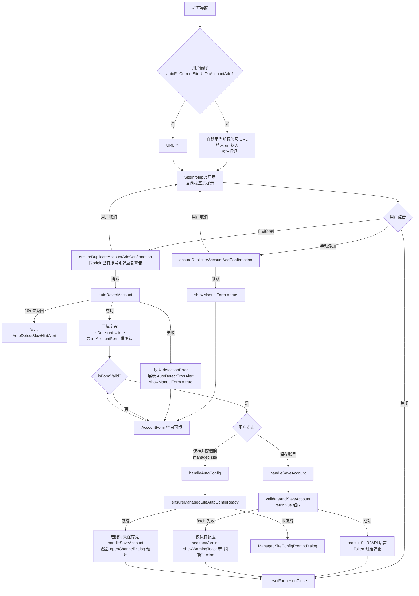
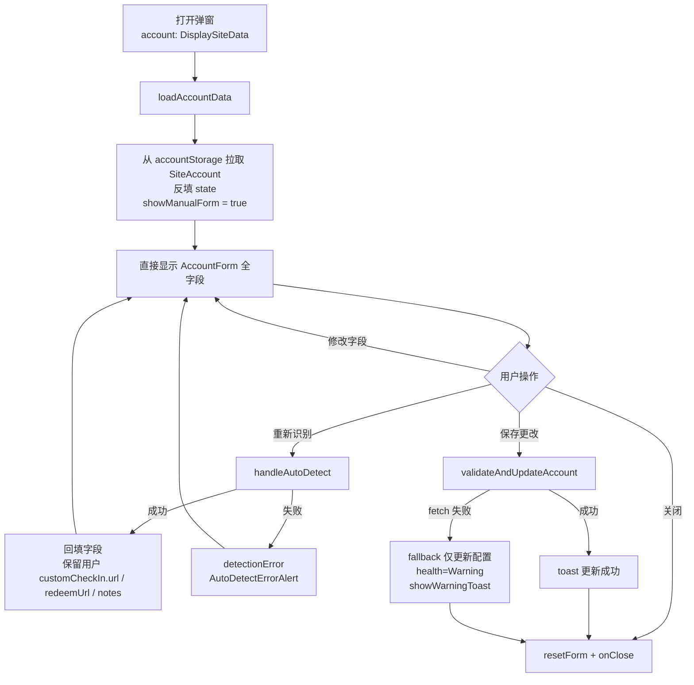
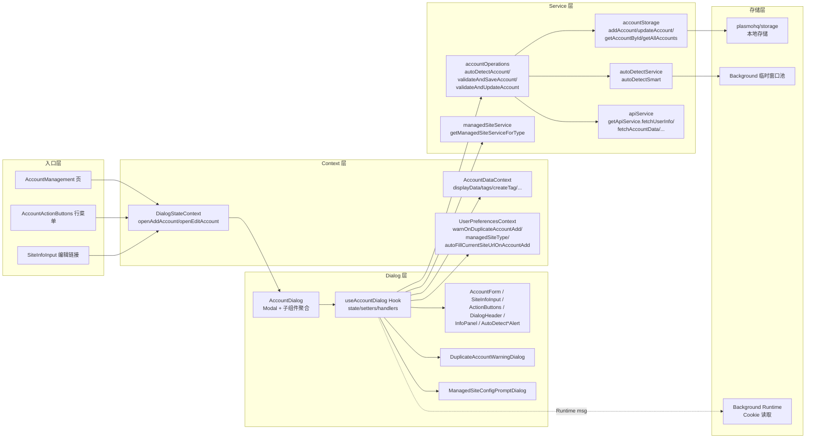
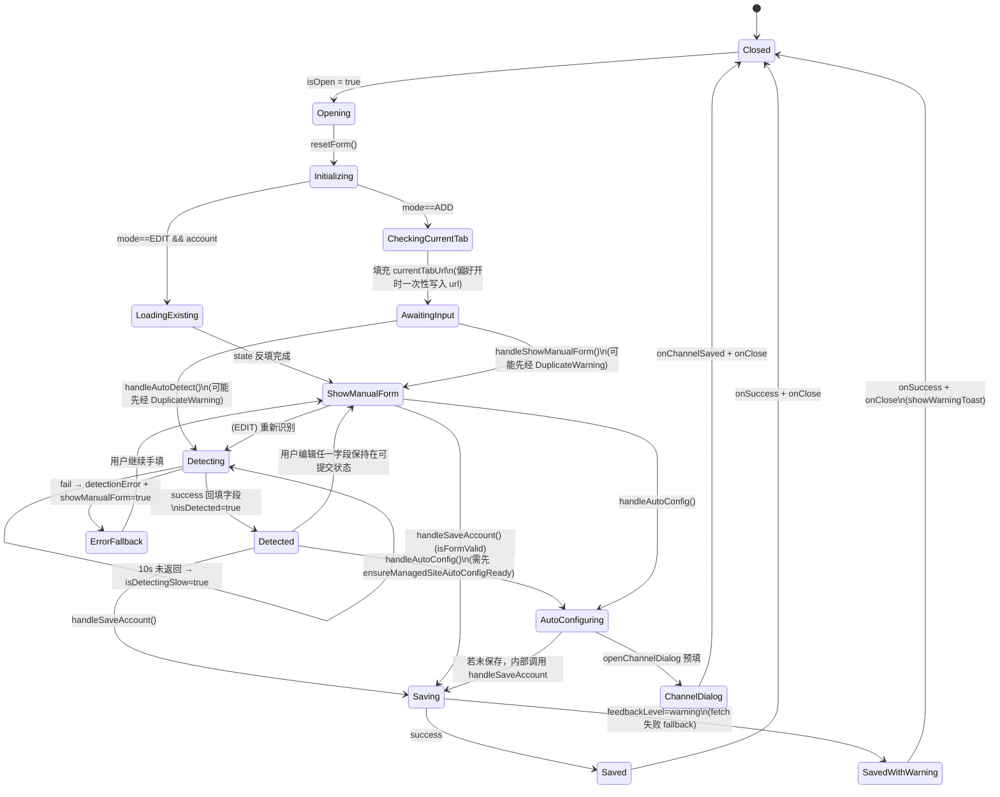

# 账号弹窗 AccountDialog · 产品需求文档（PRD + 技术规格）

| 项目 | 内容 |
| --- | --- |
| 文档名 | AccountDialog PRD |
| 版本 | v1.0 |
| 状态 | 现状反向整理（对照实现） |
| 发布日期 | 2026-04-20 |
| 适用范围 | all-api-hub 浏览器扩展 · `src/features/AccountManagement/components/AccountDialog/` |
| 目标读者 | 新入职开发、产品经理、QA/回归测试、后续重写或扩展此模块的工程师 |
| 语言 | 简体中文 |
| 阅读方式 | 独立分发，不要求读者同时打开源码即可读完 |

> 约定：本文内嵌的 TypeScript / 伪代码仅反映关键控制流，已剔除日志、早期 return、样式细节、国际化 lookup 等噪音。以"伪代码"为准，真实实现可能含少量安全兜底分支。

---

## 1. 背景与目标

### 1.1 问题背景

`all-api-hub` 是一个跨多种后端家族（One API / New API / Veloera / OneHub / DoneHub / Octopus / AnyRouter / Sub2API 等）的账号聚合扩展。每个账号在扩展侧都需要以下信息才能正常工作：

- 站点 URL、站点类型
- 认证凭据（访问令牌、会话 Cookie 或 Sub2API Refresh Token）
- 余额、今日消耗、今日充值等运行数据
- 签到配置、手动余额、排除标记、备注、标签等用户偏好

这些信息既可以**通过扩展自动从当前浏览器标签页/后台临时窗口识别**，也可以**由用户手动填写**。AccountDialog 是承担这一职责的核心 UI。

### 1.2 文档目标

- 让读者**不需要打开源码**即可理解：弹窗做什么、入口在哪、字段有哪些、如何校验、如何保存、有哪些陷阱。
- 标注**现状缺陷**与**改进方向**，作为后续重写或解耦时的起点。
- 统一术语与业务规则，方便 QA 复用为回归清单。

### 1.3 非目标

- 不展开 ChannelDialog / Sub2API Token 创建对话框的内部实现。
- 不替代源码，不记录每个 setter 的细节。
- 不覆盖多账号管理、WebDAV 同步、Key Management 等**上游/下游**模块。

---

## 2. 产品概述

### 2.1 一句话描述

> AccountDialog 是一个**二合一的模态弹窗**，支持"自动识别 + 手动编辑"两条路径，用于在扩展本地创建或更新单个站点账号的完整配置。

### 2.2 用户故事

| # | 角色 | 故事 |
| --- | --- | --- |
| US-1 | 普通用户 | 作为扩展用户，当我在目标 AI 站点登录后，希望一键识别并把该账号加入扩展，不用手填 URL/Token/UserID。 |
| US-2 | 普通用户 | 作为扩展用户，当自动识别失败时，希望能手动填写所有字段继续添加。 |
| US-3 | 普通用户 | 作为已有账号的用户，希望在列表中点击"编辑"后，弹窗预填现有信息，修改后保存并重新拉取余额。 |
| US-4 | 高级用户 | 作为多账号用户，希望同一站点可以添加多个账号，且扩展在重复时给出警告而不是阻止。 |
| US-5 | 高级用户 | 作为 Cookie 认证用户，希望能从当前已登录的浏览器标签页一键导入会话 Cookie。 |
| US-6 | Sub2API 用户 | 作为 Sub2API 用户，希望把 refresh_token 交给扩展托管，以便多个账号在同一站点并行使用。 |
| US-7 | 托管站点用户 | 作为某个 managed site（New API / Veloera / DoneHub / Octopus）的运营者，希望账号保存后可直接进入"创建渠道"对话框，预填账号信息。 |

### 2.3 目标与非目标

- **目标**
  - 覆盖所有目前支持的 siteType（见 §6.2）。
  - 在无任何网络的情况下也能保存本地配置（带健康状态警告）。
  - ADD 模式优先"识别 + 确认"体验，降低手填负担。
  - EDIT 模式保留用户自定义字段（notes、自定义签到 URL 等）不被识别结果覆盖。

- **非目标**
  - 不做"多账号批量导入"（那是其他入口的职责）。
  - 不在本弹窗处理 WebDAV 同步冲突。

---

## 3. 入口与触发位置

读者只需记住这个弹窗有 **3 个显式入口**：

| 入口 | 位置 | 模式 | 备注 |
| --- | --- | --- | --- |
| ① 账号管理页「添加账号」按钮 | AccountManagement 顶部栏 | ADD | 最主要入口 |
| ② 账号卡片行级「编辑」菜单 | AccountActionButtons 行菜单 | EDIT | 传入 `DisplaySiteData` |
| ③ SiteInfoInput 的"立即编辑"链接 | ADD 模式下，当检测到"当前登录账号已添加"时出现 | EDIT | 快速跳转到该账号的编辑 |

弹窗通过 `DialogStateContext` 统一管理可见性与 Promise 返回值：

```ts
const {
  openAddAccount,                // () => Promise<any>
  openEditAccount,               // (account: DisplaySiteData) => Promise<any>
  isAddAccountOpen, isEditAccountOpen,
  editingAccount,
  closeAddAccount, closeEditAccount,
} = useDialogStateContext()
```

上游调用方只需一行即可打开弹窗；`onSuccess/onError` 通过 Promise 回传给触发方。

---

## 4. 用户体验（UX）

### 4.1 弹窗骨架

```
┌────────────────────────────────────────────────────────────┐
│  DialogHeader                                   [X Close]  │
├───────────────────────────────┬────────────────────────────┤
│  <form id="account-form">     │                            │
│    AutoDetectErrorAlert?       │                            │
│    AutoDetectSlowHintAlert?    │   InfoPanel                │
│    SiteInfoInput (URL + auth)  │    (根据 mode / 状态        │
│    (isDetected || showManual)  │     展示不同文案与行动引导)│
│      → AccountForm (所有字段)  │                            │
│  </form>                       │                            │
├───────────────────────────────┴────────────────────────────┤
│  ActionButtons  (Cancel | 自动识别/重新识别 | 自动配置 | 保存)│
└────────────────────────────────────────────────────────────┘

[副对话框]
  DuplicateAccountWarningDialog      // ADD 专用，同 origin 重复提醒
  ManagedSiteConfigPromptDialog      // 自动配置入口未就绪时的引导
```

### 4.2 ADD 模式业务流程



### 4.3 EDIT 模式业务流程



### 4.4 ADD vs EDIT 差异对照

| 维度 | ADD | EDIT |
| --- | --- | --- |
| 弹窗标题 | `title.add`（新增账号） | `title.edit`（编辑账号） |
| URL 输入 | 可编辑；自动识别成功后锁定 | 自动识别成功后锁定，否则可编辑 |
| 初始视图 | SiteInfoInput + 自动识别/手动添加 按钮 | 直接渲染 AccountForm 全字段 |
| `showManualForm` 初始值 | `false` | `true` |
| 自动识别触发点 | 「自动识别」按钮 | 「重新识别」按钮 |
| 识别结果回填策略 | 完全覆盖 state | 深合并：保留用户自定义 `customCheckIn.url / redeemUrl / notes` 等 |
| 重复账号警告 | 启用（受 `warnOnDuplicateAccountAdd` 偏好控制） | 不触发 |
| 自动配置到 managed site 按钮 | 显示 | 隐藏 |
| 保存成功 toast | `messages.addSuccess` | `messages.updateSuccess` |
| Sub2API 后置 Token 创建对话框 | 触发（可由 `skipSub2ApiKeyPrompt` 禁用） | 不触发 |

---

## 5. 功能需求

### 5.1 字段清单

下表涵盖 AccountDialog 暴露的所有表单字段。**可见条件**列为空表示始终可见。

#### 5.1.1 基础字段

| 字段 | 类型 | 必填 | 校验 | 默认值 | 可见条件 | i18n key | testId |
| --- | --- | --- | --- | --- | --- | --- | --- |
| 站点 URL | `string` | 是 | 非空；提交前自动标准化为 `protocol://host` | ADD 模式下若偏好开启则填入当前标签页 URL | 始终可见 | `siteInfo.siteUrl` | `site-url-input` |
| 认证方式 | `AuthTypeEnum` | 是 | `AccessToken` / `Cookie`（Sub2API 强制 AccessToken） | `AccessToken` | 始终可见 | `siteInfo.authMethod` | `auth-type-trigger` |
| 网站名称 | `string` | 是 | `trim()` 非空 | ADD：从当前标签页 title 推断；EDIT：来自存储 | `isDetected \|\| showManualForm` | `form.siteName` | `site-name-input` |
| 站点类型 | `SiteType` | 否 | 枚举（见 §6.2） | `"unknown"` | `isDetected \|\| showManualForm` | `form.siteType` | `site-type-trigger` |
| 用户名 | `string` | 是（SUB2API 可空） | `trim()` 非空 | 检测/反填结果 | 同上 | `form.username` | `username-input` |
| 用户 ID | `string`（数字） | 是 | `trim()` 非空且 `parseInt` 有效 | 检测/反填结果 | 同上 | `form.userId` | `user-id-input` |
| 充值比例（CNY/USD） | `string`（数字） | 是 | 转 number 后 `> 0` 有限数 | 站点状态 API 返回的默认值或扩展默认值 | 同上 | `form.exchangeRate` | — |

#### 5.1.2 认证凭据字段

| 字段 | 类型 | 必填 | 可见条件 |
| --- | --- | --- | --- |
| 访问令牌 `accessToken` | `string`（支持明文/遮盖切换） | `authType === AccessToken` 时必填 | `authType === AccessToken` |
| 会话 Cookie `cookieAuthSessionCookie` | `string`（Textarea，原始 Cookie Header） | `authType === Cookie` 时必填；提交时经 `extractSessionCookieHeader()` 归一化 | `authType === Cookie` 且非 SUB2API |
| Sub2API Refresh Token 托管开关 `sub2apiUseRefreshToken` | `boolean` | 否 | `siteType === SUB2API` |
| Sub2API Refresh Token `sub2apiRefreshToken` | `string`（遮盖/明文切换） | 开启托管开关时必填 | `siteType === SUB2API && sub2apiUseRefreshToken` |
| Sub2API Token 过期时间 `sub2apiTokenExpiresAt` | `number \| null`（ms） | — | 同上，且值非空时只读展示 |

#### 5.1.3 可选字段

| 字段 | 类型 | 作用 |
| --- | --- | --- |
| 手动余额（USD） `manualBalanceUsd` | `string` | 非空时覆盖自动抓取的余额；`parseManualQuotaFromUsd(value) === undefined` 即为无效 |
| 不计入总余额 `excludeFromTotalBalance` | `boolean` | 仅影响"总余额"聚合统计，不禁用刷新/签到 |
| 标签 `tagIds` | `string[]` | 引用全局 Tag store，保存前自动去重 + trim |
| 备注 `notes` | `string` | 自由文本，默认 `""` |

#### 5.1.4 签到字段（`checkIn: CheckInConfig`）

| 字段 | 可见条件 | 说明 |
| --- | --- | --- |
| `enableDetection` | 始终可见（SUB2API 下被禁用并隐藏） | 签到"主开关"，关闭则不探测、不展示签到 UI |
| `autoCheckInEnabled` | `enableDetection === true` | 每日自动签到；默认 `true` |
| `customCheckIn.url` | 始终可见 | 外部签到/福利站地址 |
| `customCheckIn.openRedeemWithCheckIn` | 当 `customCheckIn.url` 非空 | 签到时是否同时打开充值页 |
| `customCheckIn.redeemUrl` | 始终可见 | 充值/兑换页面地址 |
| `customCheckIn.turnstilePreTrigger` | 仅高级数据结构，UI 不直接暴露 | 自动识别时可能由 service 写入 |
| `customCheckIn.isCheckedInToday` / `lastCheckInDate` | 运行时状态 | 由签到 scheduler 更新，表单不直接编辑 |

### 5.2 三种认证方式

#### 5.2.1 `AccessToken`（默认）

- 最常用；字段 `accessToken` 以 password 型 Input 呈现，提供眼睛图标切换明文。
- Sub2API 站点强制使用此方式（短期 JWT）。
- 自动识别时通常通过 `getOrCreateAccessToken` 自动产出。

#### 5.2.2 `Cookie`

- 字段 `cookieAuthSessionCookie` 是 Textarea，要求粘贴 Cookie Header 字符串。
- 支持**从当前登录标签页一键导入**：调用后台 `RuntimeActionIds.AccountDialogImportCookieAuthSessionCookie`，由 background 读取浏览器 Cookie 并合并为 Header 字符串返回。
- 失败场景：
  - 权限缺失（`COOKIE_IMPORT_FAILURE_REASONS.PermissionDenied`）→ 展示 `showCookiePermissionWarning` Alert，提供"前往权限设置"按钮，跳转扩展设置页 `permissions` 分区。
  - 未找到 Cookie（`NoCookiesFound`）→ toast 提示先登录。
  - 读取失败（`ReadFailed`）→ toast 展示错误原因。

#### 5.2.3 Sub2API Refresh Token 托管（可选）

- 开关 `sub2apiUseRefreshToken` 仅在 `siteType === SUB2API` 时出现。
- 开启后显示"从当前登录账号导入"按钮，流程：
  1. **优先**向"同 origin 的已登录 tab"发送 `RuntimeActionIds.ContentGetUserFromLocalStorage`，获取控制台 localStorage 中的 session。
  2. **兜底**向 background 发 `RuntimeActionIds.AutoDetectSite`，由后台启动临时窗口抓取。
- 导入成功后自动回填 `refreshToken / tokenExpiresAt / accessToken / userId / username`。
- 该 refresh_token 会**随账号一起参与备份 / WebDAV 同步**（见 `Sub2ApiAuthConfig` 注释，安全风险需留意）。

### 5.3 自动识别（核心能力）

#### 5.3.1 用户视角

- ADD 模式：按钮文案 **"自动识别" → "识别中…"**（持续 10 秒后下方出现 `AutoDetectSlowHintAlert` 引导用户查阅排查文档）。识别成功后出现确认区（AccountForm），按钮变"确认添加"。
- EDIT 模式：入口是 footer 的 **"重新识别"** 按钮；成功弹 toast，失败下方 `AutoDetectErrorAlert` 给出 `errorCode → 对应文案`。

#### 5.3.2 识别链路（引擎侧）

```
autoDetectAccount(url, authType)
  → (预热) sendRuntimeMessage(CookieInterceptorTrackUrl)
  → autoDetectSmart(url)            // 先当前 tab → background 临时窗口 → 直接 API
  → 得 { userId, siteType, sub2apiAuth? }
  → 按 effectiveAuthType 分支：
      • SUB2API         → 直接用 detect 的 accessToken / username
      • Cookie          → getApiService(siteType).fetchUserInfo({ Cookie })
      • AccessToken     → getApiService(siteType).getOrCreateAccessToken({ Cookie })
  → 并行执行：
      • tokenPromise
      • fetchSiteStatus
      • fetchSupportCheckIn
      • siteStatus.then(getSiteName)   // 推断 display 用站点名
  → 组装 data: {
      username, siteName, accessToken, userId,
      exchangeRate: extractDefaultExchangeRate(siteStatus) ?? DEFAULT,
      checkIn: { enableDetection: isSub2Api ? false : checkSupport, ... },
      siteType,
      sub2apiAuth: isSub2Api ? ... : undefined,
    }
  → 返回 { success, message, data }
```

#### 5.3.3 EDIT 模式保留策略

`handleAutoDetect` 会根据 `mode === EDIT || showManualForm` 触发 `preserveExistingCheckIn`，使用 `deepOverride(detectedCheckIn, prev)` 把**已有的**用户自定义字段合并回去。这确保：

- 已填的 `customCheckIn.url` / `customCheckIn.redeemUrl` 不被空字符串覆盖。
- 已填的 `notes` 不被覆盖。
- `autoCheckInEnabled` 等用户显式设置不会被还原。

现有自动化测试 `useAccountDialog.redetectPreservesCustomData.test.tsx` 即验证此行为。

#### 5.3.4 慢识别提示

```ts
const AUTO_DETECT_SLOW_HINT_DELAY_MS = 10_000

useEffect(() => {
  if (!isDetecting) {
    setIsDetectingSlow(false)
    clearTimeout(detectSlowHintTimeoutRef.current)
    return
  }
  setIsDetectingSlow(false)
  detectSlowHintTimeoutRef.current = setTimeout(
    () => setIsDetectingSlow(true),
    AUTO_DETECT_SLOW_HINT_DELAY_MS,
  )
}, [isDetecting])
```

### 5.4 保存流程

#### 5.4.1 ADD

```
handleSaveAccount()
  → [ADD] 再次 ensureDuplicateAccountAddConfirmation()（若用户偏好要求）
  → validateAndSaveAccount(...)
      - isValidAccount(...) 内部校验
      - parseInt(userId) 校验
      - 读取用户偏好 autoProvisionKeyOnAccountAdd / showTodayCashflow
      - manualQuota = parseManualQuotaFromUsd(manualBalanceUsd)
      - withTimeout(fetchAccountData, 20000ms)
          ∟ 成功：health=Healthy，使用实时 quota/usage
          ∟ 超时/异常：fallback，仅保存配置，health=Warning
      - accountStorage.addAccount(...)
      - void autoProvisionKeyOnAccountAdd(...)  // 非阻塞后台创建默认 key
  → 若 result.feedbackLevel === "warning" → showWarningToast（含"刷新"action）
  → 若 siteType === SUB2API && !skipSub2ApiKeyPrompt → openSub2ApiTokenCreationDialog
  → onSuccess?.(result) → onClose
```

#### 5.4.2 EDIT

```
handleSaveAccount()
  → validateAndUpdateAccount(accountId, ...)
      - 同样 isValidAccount + parseInt 校验
      - 无 20s withTimeout（EDIT 下 fetchAccountData 直接调用，失败走 fallback）
      - accountStorage.updateAccount(accountId, updateData)
          ∟ 成功：health=Healthy，使用实时 quota/usage
          ∟ 失败：fallback，health=Warning，仅更新配置
  → 成功 / warning toast
  → onSuccess?.(result) → onClose
```

#### 5.4.3 `fetchAccountData` 超时常量

```ts
export const MANUAL_ADD_ACCOUNT_DATA_FETCH_TIMEOUT_MS = 20000   // 20 秒
```

注意：超时不会取消底层请求，只是把前台流程放行到 fallback 分支；保留底层请求本身是刻意的（上游可能仍在处理）。

### 5.5 托管站点自动配置

```
handleAutoConfig()
  → ensureManagedSiteAutoConfigReady()
      - svc = getManagedSiteServiceForType(managedSiteType)  // NEW_API | VELOERA | DONE_HUB | OCTOPUS
      - managedConfig = await svc.getConfig()
      - 若不存在：弹 ManagedSiteConfigPromptDialog（"先配置 {{managedSite}}"）
  → 若账号未保存：先 handleSaveAccount({ skipSub2ApiKeyPrompt: true })
  → openChannelDialog(displaySiteData, null, onChannelSaved)
  → onChannelSaved → onSuccess?.(targetAccountRef.current)
```

前置偏好项：`managedSiteType`（来自 `UserPreferencesContext`）决定"保存并配置到 XXX"按钮的文案与可用性；`ManagedSiteType` 白名单目前是 `NEW_API | VELOERA | DONE_HUB | OCTOPUS`。

### 5.6 重复账号保护（ADD 专有）

```ts
async function ensureDuplicateAccountAddConfirmation() {
  if (mode !== DIALOG_MODES.ADD || !warnOnDuplicateAccountAdd) return true
  const normalized = normalizeUrlForOriginKey(url.trim(), { lowerCase: true })
  if (!normalized) return true
  if (ackRef.current === normalized) return true              // 同 origin 已确认过

  const existing = (await accountStorage.getAllAccounts())
    .filter(a => normalizeUrlForOriginKey(a.site_url, { lowerCase: true }) === normalized)
  if (existing.length === 0) return true

  const exact = userId.trim()
    ? existing.find(a => String(a.account_info.id) === userId.trim())
    : undefined

  const shouldContinue = await openDuplicateWarning({
    siteUrl: normalized,
    existingAccountsCount: existing.length,
    existingUsername: exact?.account_info.username,
    existingUserId: exact?.account_info.id,
  })
  if (!shouldContinue) return false
  ackRef.current = normalized
  return true
}
```

- 提示的粒度可细化到 `existingUserId/existingUsername`（匹配到同 userId 时展示更精确文案 `descriptionExact`）。
- 弹出时机：**自动识别前**、**切换到手动添加前**、**保存前**。
- 一次同 origin 确认后记录到 ref，后续同次会话内不再弹第二次。
- 偏好开关：`warnOnDuplicateAccountAdd`，关闭则完全跳过。

---

## 6. 业务规则（R1..R12）

| 编号 | 规则 |
| --- | --- |
| **R1** | `siteType === SUB2API` 强制 `authType = AccessToken`，清空 `cookieAuthSessionCookie`，并关闭 `checkIn.enableDetection / autoCheckInEnabled`。 |
| **R2** | `siteType !== SUB2API` 自动清空 `sub2apiUseRefreshToken / sub2apiRefreshToken / sub2apiTokenExpiresAt`。 |
| **R3** | 保存前 `normalizeTagIdsInput` 自动 `trim + 去重 + 过滤空值`。 |
| **R4** | `userId` 必填且须通过 `parseInt` 为有效整数；否则 `validation.userIdNumeric` 错误返回。 |
| **R5** | `exchangeRate` 须转数字后 `> 0` 有限数，否则 `isValidExchangeRate` 为 `false`、Input 显红框。 |
| **R6** | `manualBalanceUsd` 允许空；非空时须 `>= 0` 有限数，否则 `isManualBalanceUsdInvalid = true`，禁止提交。 |
| **R7** | ADD 模式 `fetchAccountData` **20 秒**超时，超时走 fallback 仅保存配置（带 `feedbackLevel: "warning"`）；EDIT 模式同样有 fallback 分支，失败时 `health` 置为 `Warning`。 |
| **R8** | 自动填充当前标签页 URL：仅当 `autoFillCurrentSiteUrlOnAccountAdd === true` 且 `url` 为空时发生，且**每次打开弹窗只消费一次**（ref 保护）。 |
| **R9** | 重复账号确认：基于 `normalizeUrlForOriginKey(..., { lowerCase: true })` 统一 origin；同次会话同 origin 确认过即不重复弹。 |
| **R10** | 自动识别成功后若 `authType === Cookie` 且 `cookieAuthSessionCookie` 为空，尝试**自动后续导入** Cookie（权限失败则展示警告）。 |
| **R11** | `siteType === SUB2API` 时，保存成功后会打开 `Sub2ApiTokenCreationDialog` 以引导创建首个 API Key（可由 `skipSub2ApiKeyPrompt` 禁用，`handleAutoConfig` 内使用）。 |
| **R12** | ADD 保存成功后，若 `autoProvisionKeyOnAccountAdd` 偏好为 true，且不是 SUB2API，且凭据充分，则**非阻塞**调用 `ensureDefaultApiTokenForAccount` 自动创建默认 Key（仅给出 toast/warning 反馈，不阻塞主流程）。 |

---

## 7. 技术规格（SPEC）

### 7.1 架构分层



### 7.2 组件树

```
AccountDialog
├── Modal (Headless UI 封装：面板 + 蒙层 + 键盘)
│   ├── DialogHeader           # 标题（根据 mode 切换）
│   ├── form#account-form
│   │   ├── AutoDetectErrorAlert       # detectionError 时展示
│   │   ├── AutoDetectSlowHintAlert    # 识别 >10s 时展示
│   │   ├── SiteInfoInput              # URL + 认证方式选择 + 当前 tab 提示
│   │   └── AccountForm                # 条件渲染：isDetected || showManualForm
│   ├── ActionButtons                  # footer: 动态组合按钮
│   └── InfoPanel                      # 右侧说明面板（随 mode/状态切文案）
├── DuplicateAccountWarningDialog
└── ManagedSiteConfigPromptDialog
```

### 7.3 Props 接口

```ts
// -- AccountDialog -----------------------------------------------------------
interface AccountDialogProps {
  isOpen: boolean
  onClose: () => void
  mode: DialogMode                      // "add" | "edit" | "view"
  account?: DisplaySiteData | null      // EDIT 模式必传
  onSuccess: (data: any) => void
  onError: (error: any) => void
}

// -- useAccountDialog --------------------------------------------------------
interface UseAccountDialogProps {
  mode: DialogMode
  account?: DisplaySiteData | null
  isOpen: boolean
  onClose: () => void
  onSuccess?: (data: any) => void
}

// -- AccountForm -------------------------------------------------------------
interface AccountFormProps {
  // 字段值
  authType: AuthTypeEnum
  siteName: string
  username: string
  userId: string
  accessToken: string
  exchangeRate: string
  manualBalanceUsd: string
  isManualBalanceUsdInvalid: boolean
  showAccessToken: boolean
  notes: string
  selectedTagIds: string[]
  excludeFromTotalBalance: boolean
  cookieAuthSessionCookie: string
  isImportingCookies: boolean
  showCookiePermissionWarning: boolean
  sub2apiUseRefreshToken: boolean
  sub2apiRefreshToken: string
  sub2apiTokenExpiresAt: number | null
  isImportingSub2apiSession: boolean
  siteType: string
  checkIn: CheckInConfig

  // 回调
  onSiteNameChange(v: string): void
  onUsernameChange(v: string): void
  onUserIdChange(v: string): void
  onAccessTokenChange(v: string): void
  onExchangeRateChange(v: string): void
  onManualBalanceUsdChange(v: string): void
  onToggleShowAccessToken(): void
  onNotesChange(v: string): void
  onSelectedTagIdsChange(v: string[]): void
  onExcludeFromTotalBalanceChange(v: boolean): void
  onCookieAuthSessionCookieChange(v: string): void
  onImportCookieAuthSessionCookie(): void
  onOpenCookiePermissionSettings(): void
  onSub2apiUseRefreshTokenChange(v: boolean): void
  onSub2apiRefreshTokenChange(v: string): void
  onImportSub2apiSession(): void
  onSiteTypeChange(v: string): void
  onCheckInChange(v: CheckInConfig): void

  // 标签注入
  tags: Tag[]
  tagCountsById?: Record<string, number>
  createTag(name: string): Promise<Tag>
  renameTag(tagId: string, name: string): Promise<Tag>
  deleteTag(tagId: string): Promise<{ updatedAccounts: number }>
}

// -- SiteInfoInput -----------------------------------------------------------
interface SiteInfoInputProps {
  url: string
  onUrlChange(v: string): void
  isDetected: boolean
  onClearUrl(): void
  siteType?: string
  authType: AuthTypeEnum
  onAuthTypeChange(t: AuthTypeEnum): void
  // ADD 模式扩展 props
  currentTabUrl?: string | null
  isCurrentSiteAdded?: boolean
  detectedAccount?: DisplaySiteData | null
  onUseCurrentTab?(): void
  onEditAccount?(account: DisplaySiteData): void
}

// -- ActionButtons -----------------------------------------------------------
interface ActionButtonsProps {
  mode: DialogMode
  url: string
  isDetecting: boolean
  isSaving: boolean
  isFormValid: boolean
  isDetected?: boolean
  onAutoDetect(): void
  onShowManualForm(): void
  onClose(): void
  onAutoConfig(): Promise<void>
  isAutoConfiguring: boolean
  formId?: string                       // 关联 form#account-form 用于 footer 提交
}
```

### 7.4 `useAccountDialog` 返回结构

```ts
return {
  state: {
    // URL & 识别
    url, isDetecting, isDetectingSlow, isDetected, detectionError,
    showManualForm, currentTabUrl,

    // 基础字段
    siteName, username, userId, accessToken, showAccessToken,
    exchangeRate, manualBalanceUsd, isManualBalanceUsdInvalid,
    siteType, notes, tagIds, excludeFromTotalBalance, checkIn,

    // 认证相关
    authType, cookieAuthSessionCookie,
    isImportingCookies, showCookiePermissionWarning,

    // Sub2API 相关
    sub2apiUseRefreshToken, sub2apiRefreshToken, sub2apiTokenExpiresAt,
    isImportingSub2apiSession,

    // 聚合状态
    isSaving, isAutoConfiguring, isFormValid,

    // 子对话框状态
    duplicateAccountWarning: {
      isOpen, siteUrl, existingAccountsCount,
      existingUsername, existingUserId,
    },
    managedSiteConfigPrompt: { isOpen, managedSiteLabel, missingMessage },
  },

  setters: {
    setUrl, setSiteName, setUsername, setAccessToken, setUserId,
    setShowAccessToken, setShowManualForm,
    setExchangeRate, setManualBalanceUsd,
    setNotes, setTagIds, setExcludeFromTotalBalance,
    setCheckIn, setSiteType, setAuthType,
    setCookieAuthSessionCookie,
    setSub2apiRefreshToken, setSub2apiTokenExpiresAt,
  },

  handlers: {
    handleAutoDetect, handleShowManualForm, handleSaveAccount,
    handleUseCurrentTabUrl, handleClearUrl, handleUrlChange,
    handleSubmit, handleAutoConfig, handleClose,
    handleImportCookieAuthSessionCookie, handleOpenCookiePermissionSettings,
    handleImportSub2apiSession, handleSub2apiUseRefreshTokenChange,
    handleDuplicateAccountWarningCancel, handleDuplicateAccountWarningContinue,
    handleManagedSiteConfigPromptClose, handleOpenManagedSiteSettings,
  },
}
```

### 7.5 状态机



### 7.6 关键 handler 伪代码

#### 7.6.1 `handleAutoDetect`

```ts
async function handleAutoDetect() {
  if (!url.trim()) return

  // 1) ADD 模式重复账号确认
  const shouldContinue = await ensureDuplicateAccountAddConfirmation()
  if (!shouldContinue) return

  setIsDetecting(true)
  setDetectionError(null)
  // 10s 慢提示由 isDetecting 的 useEffect 负责

  try {
    const result = await autoDetectAccount(url.trim(), authType)

    if (!result.success) {
      setDetectionError(result.detailedError ?? null)
      setShowManualForm(true)
      return
    }

    const d = result.data!
    setUsername(d.username)
    setAccessToken(d.accessToken)
    setUserId(d.userId)

    if (d.siteType === SUB2API && d.sub2apiAuth) {
      setSub2apiRefreshToken(d.sub2apiAuth.refreshToken)
      setSub2apiTokenExpiresAt(d.sub2apiAuth.tokenExpiresAt ?? null)
    }

    const detectedCheckIn: CheckInConfig = {
      ...(d.checkIn ?? {}),
      enableDetection:   d.checkIn?.enableDetection   ?? false,
      autoCheckInEnabled:d.checkIn?.autoCheckInEnabled ?? true,
      siteStatus: { isCheckedInToday: d.checkIn?.siteStatus?.isCheckedInToday ?? false },
      customCheckIn: {
        url:       d.checkIn?.customCheckIn?.url       ?? "",
        redeemUrl: d.checkIn?.customCheckIn?.redeemUrl ?? "",
        openRedeemWithCheckIn: d.checkIn?.customCheckIn?.openRedeemWithCheckIn ?? true,
        isCheckedInToday:      d.checkIn?.customCheckIn?.isCheckedInToday ?? false,
      },
    }
    // EDIT 或手动模式下保留用户自定义
    const preserveExisting = mode === DIALOG_MODES.EDIT || showManualForm
    setCheckIn(prev => preserveExisting ? deepOverride(detectedCheckIn, prev) : detectedCheckIn)

    if (d.exchangeRate) setExchangeRate(String(d.exchangeRate))
    else if (mode === DIALOG_MODES.ADD) setExchangeRate("")

    if (d.siteType) {
      setSiteType(d.siteType)
      if (d.siteType === SUB2API) {
        setAuthType(AuthTypeEnum.AccessToken)
        setCookieAuthSessionCookie("")
        setCheckIn(prev => ({ ...prev, enableDetection: false, autoCheckInEnabled: false }))
      }
    }

    // Cookie 认证后续自动导入
    if (authType === AuthTypeEnum.Cookie
        && d.siteType !== SUB2API
        && !cookieAuthSessionCookie.trim()
        && url.trim()) {
      const resp = await sendRuntimeMessage({
        action: RuntimeActionIds.AccountDialogImportCookieAuthSessionCookie,
        url: url.trim(),
      })
      const header = typeof resp?.data === "string" ? resp.data.trim() : ""
      if (header) {
        setCookieAuthSessionCookie(header)
        setShowCookiePermissionWarning(false)
      } else if (resp?.errorCode === COOKIE_IMPORT_FAILURE_REASONS.PermissionDenied) {
        setShowCookiePermissionWarning(true)
        toast.error(t("messages.importCookiesPermissionDenied"))
      }
    }

    setIsDetected(true)
    setSiteName(d.siteName)
    if (mode === DIALOG_MODES.EDIT) toast.success(t("messages.autoDetectSuccess"))
  } catch (err) {
    setDetectionError(analyzeAutoDetectError(err))
    setShowManualForm(true)
  } finally {
    setIsDetecting(false)
  }
}
```

#### 7.6.2 `handleSaveAccount`

```ts
async function handleSaveAccount(options?: { skipSub2ApiKeyPrompt?: boolean }) {
  setIsSaving(true)
  try {
    const sub2apiAuth: Sub2ApiAuthConfig | undefined =
      (siteType === SUB2API && sub2apiUseRefreshToken && sub2apiRefreshToken.trim())
        ? {
            refreshToken: sub2apiRefreshToken.trim(),
            ...(typeof sub2apiTokenExpiresAt === "number"
              ? { tokenExpiresAt: sub2apiTokenExpiresAt } : {}),
          }
        : undefined

    const result = mode === DIALOG_MODES.ADD
      ? await validateAndSaveAccount(
          url.trim(), siteName.trim(), username.trim(),
          accessToken.trim(), userId.trim(), exchangeRate,
          notes.trim(), tagIds, checkIn,
          siteType, authType, cookieAuthSessionCookie.trim(),
          manualBalanceUsd, excludeFromTotalBalance, sub2apiAuth,
        )
      : await validateAndUpdateAccount(
          account!.id,
          url.trim(), siteName.trim(), username.trim(),
          accessToken.trim(), userId.trim(), exchangeRate,
          notes.trim(), tagIds, checkIn,
          siteType, authType, cookieAuthSessionCookie.trim(),
          manualBalanceUsd, excludeFromTotalBalance, sub2apiAuth,
        )

    if (!result.success) throw new Error(result.message || t("messages.saveFailed"))

    const feedbackMessage = result.message?.trim()
      || t(mode === DIALOG_MODES.ADD ? "messages.addSuccess" : "messages.updateSuccess",
           { name: siteName })

    if (result.feedbackLevel === "warning") {
      // 带 "刷新" action 的 warning toast，用户点击会重新拉取 account 数据
      showWarningToast(feedbackMessage, { action: buildRefreshAction(result.accountId) })
    } else {
      toast.success(feedbackMessage)
    }

    // SUB2API 后置 Token 创建对话框（ADD 才触发）
    if (siteType === SUB2API
        && !options?.skipSub2ApiKeyPrompt
        && typeof result.accountId === "string") {
      const display = await accountStorage.getDisplayDataById(result.accountId)
      if (display) await openSub2ApiTokenCreationDialog(display)
    }

    return result
  } catch (err) {
    toast.error(t("messages.operationFailed", { error: getErrorMessage(err) }))
    throw err
  } finally {
    setIsSaving(false)
  }
}
```

#### 7.6.3 `loadAccountData`（EDIT 初始化）

```ts
async function loadAccountData(accountId: string) {
  const siteAccount = await accountStorage.getAccountById(accountId)
  if (!siteAccount) return

  setUrl(siteAccount.site_url)
  setSiteName(siteAccount.site_name)
  setUsername(siteAccount.account_info.username)
  setAccessToken(siteAccount.account_info.access_token)
  setUserId(String(siteAccount.account_info.id))
  setExchangeRate(String(siteAccount.exchange_rate))
  setManualBalanceUsd(siteAccount.manualBalanceUsd ?? "")
  setNotes(siteAccount.notes ?? "")
  setTagIds(siteAccount.tagIds ?? [])
  setExcludeFromTotalBalance(siteAccount.excludeFromTotalBalance === true)
  setCheckIn(normalizeCheckIn(siteAccount.checkIn))
  setSiteType(siteAccount.site_type || "")
  setAuthType(siteAccount.authType || AuthTypeEnum.AccessToken)
  setCookieAuthSessionCookie(siteAccount.cookieAuth?.sessionCookie || "")

  const refreshToken = siteAccount.sub2apiAuth?.refreshToken ?? ""
  setSub2apiRefreshToken(refreshToken)
  setSub2apiTokenExpiresAt(siteAccount.sub2apiAuth?.tokenExpiresAt ?? null)
  setSub2apiUseRefreshToken(Boolean(refreshToken.trim()))

  // showManualForm 在 mode===EDIT 时由 resetForm 已置 true
}
```

#### 7.6.4 `handleImportCookieAuthSessionCookie`

```ts
async function handleImportCookieAuthSessionCookie() {
  if (!url.trim()) { toast.error(t("messages.urlRequired")); return }
  setIsImportingCookies(true)
  try {
    const resp = await sendRuntimeMessage<CookieImportResponse>({
      action: RuntimeActionIds.AccountDialogImportCookieAuthSessionCookie,
      url: url.trim(),
    })

    if (resp?.success && resp.data) {
      setCookieAuthSessionCookie(resp.data)
      setShowCookiePermissionWarning(false)
      toast.success(t("messages.importCookiesSuccess"))
      return
    }

    setShowCookiePermissionWarning(false)
    switch (resp?.errorCode) {
      case COOKIE_IMPORT_FAILURE_REASONS.PermissionDenied:
        setShowCookiePermissionWarning(true)
        toast.error(t("messages.importCookiesPermissionDenied"))
        break
      case COOKIE_IMPORT_FAILURE_REASONS.ReadFailed:
        toast.error(resp.error
          ? t("messages.importCookiesFailed", { error: resp.error })
          : t("messages.importCookiesFailedUnknown"))
        break
      case COOKIE_IMPORT_FAILURE_REASONS.NoCookiesFound:
      default:
        toast.error(t("messages.importCookiesEmpty"))
    }
  } catch (err) {
    toast.error(t("messages.importCookiesFailed", { error: getErrorMessage(err) }))
  } finally {
    setIsImportingCookies(false)
  }
}
```

#### 7.6.5 `handleImportSub2apiSession`

```ts
async function handleImportSub2apiSession() {
  if (!url.trim()) { toast.error(t("messages.urlRequired")); return }
  setIsImportingSub2apiSession(true)
  try {
    const baseUrl = url.trim()
    const targetOrigin = tryParseOrigin(baseUrl)
    let imported: any | null = null

    // 1) 优先：向同 origin 的已登录 tab 发消息
    if (targetOrigin && browser?.tabs?.sendMessage) {
      const candidates = (await getAllTabs())
        .filter(tab => tab?.id && tab.url && tryParseOrigin(tab.url) === targetOrigin)
        .sort((a, b) => Number(Boolean(b.active)) - Number(Boolean(a.active)))
      for (const tab of candidates) {
        const resp = await browser.tabs.sendMessage(tab.id!, {
          action: RuntimeActionIds.ContentGetUserFromLocalStorage,
          url: baseUrl,
        }).catch(() => null)
        if (resp?.success && resp.data) { imported = resp.data; break }
      }
    }

    // 2) 兜底：后台 AutoDetectSite，临时窗口抓取
    if (!imported) {
      const resp = await sendRuntimeMessage({
        action: RuntimeActionIds.AutoDetectSite,
        url: baseUrl,
        requestId: `account-dialog-sub2api-import-${Date.now()}`,
      })
      if (resp?.success && resp.data) imported = resp.data
    }

    const refreshToken = imported?.sub2apiAuth?.refreshToken?.trim?.() ?? ""
    if (!refreshToken) { toast.error(t("messages.importSub2apiSessionMissing")); return }

    setSub2apiRefreshToken(refreshToken)
    const expiresAt = imported?.sub2apiAuth?.tokenExpiresAt
    setSub2apiTokenExpiresAt(typeof expiresAt === "number" && Number.isFinite(expiresAt) ? expiresAt : null)

    if (typeof imported?.accessToken === "string" && imported.accessToken.trim())
      setAccessToken(imported.accessToken.trim())
    if (typeof imported?.userId === "number" && Number.isFinite(imported.userId))
      setUserId(String(imported.userId))
    if (typeof imported?.user?.username === "string")
      setUsername(imported.user.username.trim())

    toast.success(t("messages.importSub2apiSessionSuccess"))
  } catch (err) {
    toast.error(t("messages.operationFailed", { error: getErrorMessage(err) }))
  } finally {
    setIsImportingSub2apiSession(false)
  }
}
```

#### 7.6.6 `handleAutoConfig`

```ts
async function handleAutoConfig() {
  // 1) 前置：检查 managed site 是否已配置
  const ready = await ensureManagedSiteAutoConfigReady()
  if (!ready) return                            // 会弹 ManagedSiteConfigPromptDialog

  setIsAutoConfiguring(true)
  try {
    let target: DisplaySiteData | string | null | undefined =
      account || newAccountRef.current

    // 2) 若新增且未保存，先保存（跳过 Sub2API token 提示）
    if (!target) {
      const saveResult = await handleSaveAccount({ skipSub2ApiKeyPrompt: true })
      target = saveResult.accountId
      if (!target) { toast.error(t("messages.saveAccountFailed")); return }
      newAccountRef.current = target
    }
    targetAccountRef.current = target

    // 3) 拿到 DisplaySiteData
    const display = typeof target === "string"
      ? (await accountStorage.getDisplayDataById(target))
         ?? accountStorage.convertToDisplayData(
              (await accountStorage.getAccountById(target))!)
      : target

    // 4) 打开 ChannelDialog 预填，等待用户确认创建渠道
    await openChannelDialog(display, null, () => {
      if (onSuccess && targetAccountRef.current) onSuccess(targetAccountRef.current)
    })
  } catch (err) {
    toast.error(t("messages.newApiConfigFailed", { error: getErrorMessage(err) }))
  } finally {
    setIsAutoConfiguring(false)
  }
}
```

#### 7.6.7 Sub2API 约束 `useEffect`

```ts
// R1：强制 AccessToken、清 Cookie、禁签到
useEffect(() => {
  if (siteType !== SUB2API) return
  if (authType !== AuthTypeEnum.AccessToken) setAuthType(AuthTypeEnum.AccessToken)
  if (cookieAuthSessionCookie.trim()) setCookieAuthSessionCookie("")
  setCheckIn(prev => ({ ...prev, enableDetection: false, autoCheckInEnabled: false }))
}, [authType, cookieAuthSessionCookie, siteType])

// R2：离开 SUB2API 时清理 refresh token 相关状态
useEffect(() => {
  if (siteType === SUB2API) return
  if (sub2apiUseRefreshToken) setSub2apiUseRefreshToken(false)
  if (sub2apiRefreshToken) setSub2apiRefreshToken("")
  if (sub2apiTokenExpiresAt !== null) setSub2apiTokenExpiresAt(null)
}, [siteType, sub2apiRefreshToken, sub2apiTokenExpiresAt, sub2apiUseRefreshToken])
```

#### 7.6.8 `handleUrlChange`

```ts
function handleUrlChange(newUrl: string) {
  // URL 变动：重置重复账号确认 ack；标记自动填充已消费
  duplicateAckRef.current = null
  hasConsumedAutoFillCurrentSiteUrlRef.current = true
  if (!newUrl.trim()) {
    setUrl("")
    if (mode === DIALOG_MODES.ADD) setSiteName("")
    return
  }
  try {
    const u = new URL(newUrl)
    setUrl(`${u.protocol}//${u.host}`)           // 标准化为 origin
  } catch {
    setUrl(newUrl)
  }
}
```

### 7.7 数据模型（完整 TS 内嵌）

```ts
// -- 认证方式 ----------------------------------------------------------------
enum AuthTypeEnum {
  AccessToken = "access_token",
  Cookie      = "cookie",
  None        = "none",
}

// -- 账号基础信息 ------------------------------------------------------------
interface AccountInfo {
  id: number                              // 用户 ID（整数）
  access_token: string
  username: string
  quota: number                           // 总余额点数（内部 unit）
  today_prompt_tokens: number
  today_completion_tokens: number
  today_quota_consumption: number
  today_requests_count: number
  today_income: number
}

interface CookieAuthConfig {
  sessionCookie: string                   // Cookie Header 字符串
}

interface Sub2ApiAuthConfig {
  refreshToken: string                    // 随账号参与备份/WebDAV（高敏感）
  tokenExpiresAt?: number                 // ms since epoch
}

// -- 签到配置 ----------------------------------------------------------------
interface CheckInConfig {
  enableDetection: boolean                // 签到主开关
  autoCheckInEnabled?: boolean            // 每日自动签到（默认 true）
  siteStatus?: {                          // 站点内建签到（API 探测）
    isCheckedInToday?: boolean
    lastCheckInDate?: string              // YYYY-MM-DD
    lastDetectedAt?: number
  }
  customCheckIn?: {                       // 外部签到（URL 打开）
    url?: string
    turnstilePreTrigger?: TurnstilePreTrigger
    redeemUrl?: string
    openRedeemWithCheckIn?: boolean       // 默认 true
    isCheckedInToday?: boolean
    lastCheckInDate?: string
  }
}

// -- 站点账号完整模型 --------------------------------------------------------
interface SiteAccount {
  id: string
  site_name: string
  site_url: string
  health: HealthStatus                    // Healthy / Warning / Error / Unknown
  site_type: string                       // 见 §6.2
  exchange_rate: number                   // CNY per USD
  account_info: AccountInfo
  last_sync_time: number
  updated_at: number
  created_at: number
  notes: string                           // 始终 string，默认 ""
  tagIds: string[]                        // 引用全局 Tag store
  disabled: boolean                       // 禁用后不参与刷新/签到
  excludeFromTotalBalance: boolean        // 仅影响"总余额"聚合
  authType: AuthTypeEnum
  cookieAuth?: CookieAuthConfig
  sub2apiAuth?: Sub2ApiAuthConfig
  checkIn: CheckInConfig
  manualBalanceUsd?: string               // 非空时覆盖自动余额
  configVersion?: number                  // 迁移用版本号（0..5）

  // 历史遗留字段
  tags?: string[]                         // @deprecated 旧标签名
  can_check_in?: boolean                  // @deprecated
  supports_check_in?: boolean             // @deprecated
  emoji?: string                          // @deprecated
}

// -- UI 投影模型 -------------------------------------------------------------
interface DisplaySiteData {
  id: string
  name: string
  baseName?: string
  username: string
  balance: { USD: number; CNY: number }
  todayConsumption: { USD: number; CNY: number }
  todayIncome: { USD: number; CNY: number }
  todayTokens: { upload: number; download: number }
  health: HealthStatus
  last_sync_time?: number
  created_at?: number
  siteType: string
  baseUrl: string
  token: string                            // 访问令牌
  userId: number
  notes?: string
  tagIds?: string[]
  tags?: string[]                          // UI 便利字段（由 tagIds 解析）
  disabled?: boolean
  excludeFromTotalBalance?: boolean
  authType: AuthTypeEnum
  accountId?: string
  cookieAuthSessionCookie?: string
  checkIn: CheckInConfig
}

// -- 标签 --------------------------------------------------------------------
interface Tag {
  id: string
  name: string
  createdAt: number
  updatedAt: number
}

// -- 健康状态 ----------------------------------------------------------------
enum SiteHealthStatus {
  Healthy = "healthy",
  Warning = "warning",
  Error   = "error",
  Unknown = "unknown",
}
interface HealthStatus {
  status: SiteHealthStatus
  reason?: string
  code?: HealthStatusCode                 // 可被 UI 映射为跳转 action
}
```

### 7.8 Service 层签名

```ts
// src/services/accounts/accountOperations.ts

export const MANUAL_ADD_ACCOUNT_DATA_FETCH_TIMEOUT_MS = 20000

interface AccountValidationResponse {
  success: boolean
  message: string
  data?: {
    username: string
    siteName: string
    accessToken: string
    userId: string                        // 注意是字符串
    exchangeRate?: number
    checkIn: CheckInConfig
    siteType: string
    sub2apiAuth?: Sub2ApiAuthConfig
  }
  detailedError?: AutoDetectError
}

interface AccountSaveResponse {
  success: boolean
  message: string
  accountId?: string
  feedbackLevel?: "success" | "warning"
}

declare function autoDetectAccount(
  url: string,
  authType: AuthTypeEnum,
): Promise<AccountValidationResponse>

declare function validateAndSaveAccount(
  url: string, siteName: string, username: string, accessToken: string,
  userId: string, exchangeRate: string, notes: string,
  tagIds: string[] | undefined, checkInConfig: CheckInConfig,
  siteType: string, authType: AuthTypeEnum,
  cookieAuthSessionCookie: string,
  manualBalanceUsd?: string,
  excludeFromTotalBalance?: boolean,
  sub2apiAuth?: Sub2ApiAuthConfig,
): Promise<AccountSaveResponse>

declare function validateAndUpdateAccount(
  accountId: string,
  /* 其余参数同 validateAndSaveAccount */
): Promise<AccountSaveResponse>

declare function isValidAccount(fields: {
  siteName: string; username: string; userId: string
  siteType?: string
  authType: AuthTypeEnum
  accessToken: string
  cookieAuthSessionCookie?: string
  exchangeRate: string
}): boolean

declare function parseManualQuotaFromUsd(value: string | undefined): number | undefined
declare function isValidExchangeRate(rate: string): boolean
declare function getSiteName(
  input: browser.tabs.Tab | string,
  siteTypeHint?: string,
  siteStatusInfo?: { system_name?: string | null } | null,
): Promise<string>

// src/services/accounts/accountStorage.ts  (仅列 Dialog 依赖的方法)
declare const accountStorage: {
  addAccount(data: Omit<SiteAccount, "id" | "created_at" | "updated_at">): Promise<string>
  updateAccount(id: string, patch: Partial<Omit<SiteAccount, "id" | "created_at">>): Promise<boolean>
  getAccountById(id: string): Promise<SiteAccount | null>
  getAllAccounts(): Promise<SiteAccount[]>
  getDisplayDataById(id: string): Promise<DisplaySiteData | null>
  convertToDisplayData(account: SiteAccount): DisplaySiteData
  refreshAccount(id: string, force?: boolean): Promise<{ refreshed: boolean }>
}
```

### 7.9 Runtime Messaging

```ts
// src/constants/runtimeActions.ts
enum RuntimeActionIds {
  AccountDialogImportCookieAuthSessionCookie = "...",  // background 读取 Cookie
  CookieInterceptorTrackUrl                  = "...",  // 在识别前注册拦截器
  AutoDetectSite                             = "...",  // 后台临时窗口抓取识别
  ContentGetUserFromLocalStorage             = "...",  // 向 content script 请求 localStorage
}

// Cookie 导入响应契约
interface CookieImportResponse {
  success?: boolean
  data?: string                     // 成功时：Cookie Header 字符串
  error?: string
  errorCode?:                       // 来自 src/constants/cookieImport.ts
    | "PermissionDenied"
    | "ReadFailed"
    | "NoCookiesFound"
}

// Sub2API 会话导入响应（由 content / background 返回）
// 期望字段：
//   { success, data: { sub2apiAuth: { refreshToken, tokenExpiresAt? },
//                      accessToken?, userId?, user?: { username? } } }
```

---

## 6. 站点类型与 Managed Site

### 6.1 全体 siteType 白名单

| 常量 | 字符串值 | 备注 |
| --- | --- | --- |
| `ONE_API` | `one-api` | 上游原始家族 |
| `NEW_API` | `new-api` | One API 下游；主要通用实现 |
| `ANYROUTER` | `anyrouter` | 自定义签到 |
| `VELOERA` | `Veloera` | New API 下游，独立 overrides |
| `ONE_HUB` | `one-hub` | 独立 API 实现 |
| `DONE_HUB` | `done-hub` | 基于 OneHub 的 overrides |
| `VO_API` | `VoAPI` | |
| `SUPER_API` | `Super-API` | |
| `RIX_API` | `Rix-Api` | |
| `NEO_API` | `neo-Api` | |
| `WONG_GONGYI` | `wong-gongyi` | 自定义签到 |
| `SUB2API` | `sub2api` | 独立后端家族 / 触发大量特殊规则 |
| `OCTOPUS` | `octopus` | 独立实现 |
| `UNKNOWN_SITE` | `unknown` | 兜底 |

### 6.2 ManagedSiteType 白名单（影响"自动配置"按钮）

```ts
type ManagedSiteType = "new-api" | "Veloera" | "done-hub" | "octopus"
```

用户可在 `UserPreferencesContext` 中配置 `managedSiteType`，弹窗据此决定"保存并配置到 {{managedSite}}"按钮的文案与可用性。

### 6.3 siteType 变化的副作用（总结）

- 切换到 `SUB2API` 触发 R1（强制 AccessToken、清 Cookie、禁签到），同时解锁 Sub2API 专属 UI（Refresh Token 托管开关 + 导入按钮）。
- 从 `SUB2API` 切换走触发 R2（清理 Sub2API 状态）。
- `UNKNOWN_SITE` 在 AccountForm 中作为 Select 默认显示，实际保存仍按当前值。

---

## 8. 国际化与测试

### 8.1 i18n 命名空间：`accountDialog`

使用模式：

```tsx
const { t } = useTranslation(["accountDialog", "common", "messages", "settings"])
t("accountDialog:form.siteName")
// 或在已加载 accountDialog 默认命名空间时直接：
t("form.siteName")
```

**完整分组与代表性文案（简体中文）：**

```json
// 标题
"title":    { "add": "新增账号", "edit": "编辑账号" }

// 操作按钮
"actions":  {
  "saveAccount":              "保存账号",
  "saveChanges":              "保存更改",
  "confirmAdd":               "确认添加",
  "configToManagedSite":      "保存并配置到 {{managedSite}}",
  "configuring":              "配置中...",
  "autoConfigAriaLabel":      "保存账号并前往 {{managedSite}} 渠道配置",
  "autoConfigRequiresValidAccount": "请先补全当前账号信息",
  "autoConfigTitle":          "保存当前账号，并打开 {{managedSite}} 的预填渠道配置",
  "helpDocument":             "帮助文档",
  "reloadCurrentPage":        "刷新当前页面"
}

// 按钮/模式标签
"mode":     {
  "autoDetect": "自动识别", "detecting": "识别中...",
  "manualAdd":  "手动添加", "reDetect":  "重新识别"
}

// SiteInfoInput
"siteInfo": {
  "siteUrl":                  "网站 URL",
  "authMethod":               "认证方式",
  "authMethodPlaceholder":    "认证方式",
  "authType.accessToken":     "访问令牌认证",
  "authType.cookieAuth":      "Cookie 认证",
  "cookieWarning":            "推荐优先使用访问令牌。...",
  "currentSite":              "当前站点",
  "useCurrent":               "使用当前站点",
  "unknown":                  "无法获取",
  "alreadyAdded":             "该站点已存在账号",
  "currentLoginAlreadyAdded": "当前登录账号已添加",
  "editNow":                  "立即编辑",
  "sub2apiAuthOnly":          "Sub2API 仅支持访问令牌认证（JWT）",
  "sub2apiHint":              "Sub2API 使用短期 JWT，..."
}

// AccountForm 字段
"form":     {
  "siteName":                  "网站名称",
  "siteType":                  "站点类型",
  "username":                  "用户名",
  "userId":                    "用户 ID",
  "userIdNumber":              "用户 ID（数字）",
  "accessToken":               "访问令牌",
  "exchangeRate":              "充值金额比例（CNY/USD）",
  "exchangeRateDesc":          "表示充值 1 美元需要多少人民币。...",
  "exchangeRatePlaceholder":   "请输入充值比例",
  "validRateError":            "请输入有效的汇率，大于 0",
  "manualBalanceUsd":          "手动余额 (USD)",
  "manualBalanceUsdDesc":      "当站点无法自动获取余额/额度时，可手动填写",
  "manualBalanceUsdError":     "请输入有效的金额（>= 0）",
  "manualBalanceUsdPlaceholder": "留空则自动获取",
  "excludeFromTotalBalance":   "不计入总余额",
  "excludeFromTotalBalanceDesc": "仅影响"总余额"统计，不会禁用刷新、签到等功能",
  "checkInStatus":             "签到状态检测（需站点本身已开启签到功能）",
  "autoCheckInEnabled":        "启用每日自动签到",
  "autoCheckInEnabledDesc":    "在全局自动签到功能启用时，此账号是否参与每日签到",
  "customCheckInUrl":          "外部签到站点 URL（可选）",
  "customCheckInDesc":         "外部签到站、福利站等...",
  "customRedeemUrl":           "自定义充值/兑换页面 URL（可选）",
  "customRedeemUrlDesc":       "充值/兑换页面的 URL",
  "openRedeemWithCheckIn":     "使用外部签到时同时打开充值页面",
  "cookieAuthSessionCookie":   "会话 Cookie",
  "cookieAuthSessionCookieDesc": "从当前已登录的浏览器标签页导入...",
  "cookieAuthSessionCookiePlaceholder": "粘贴 Cookie 头部值",
  "importCookieAuthSessionCookie": "从当前登录导入",
  "cookiePermissionHelpAction": "前往权限设置",
  "sub2apiRefreshToken":       "Refresh Token",
  "sub2apiRefreshTokenMode":   "插件托管会话（多账号）",
  "sub2apiRefreshTokenModeDesc": "可选。将当前登录账号的 refresh_token 存入扩展...",
  "sub2apiRefreshTokenPlaceholder": "粘贴 refresh_token 值",
  "sub2apiRefreshTokenWarningTitle": "提示",
  "sub2apiRefreshTokenWarningDesc": "refresh_token 用于让扩展独立续期登录态...",
  "sub2apiImportRefreshToken": "从当前登录账号导入",
  "sub2apiTokenExpiresAt":     "访问令牌过期时间",
  "sub2apiCheckInUnsupported": "Sub2API 暂不支持站点签到功能（已自动关闭）。",
  "toggleAccessTokenVisibility":  "切换访问令牌的可见性",
  "toggleRefreshTokenVisibility": "切换 Refresh Token 的可见性",
  "tags":                      "标签",
  "tagsPlaceholder":           "添加或选择标签",
  "tagsDescription":           "使用标签对账号进行分类，便于快速筛选",
  "tagsCreate":                "创建“{{name}}”",
  "tagsRename":                "重命名",
  "tagsDelete":                "删除",
  "tagsDeleteTitle":           "删除标签",
  "tagsDeleteDescription":     "全局删除“{{name}}”。此操作会从所有账号中移除该标签。",
  "tagsSelectedCount":         "已选择 {{count}} 个标签",
  "tagsNoResults":             "未找到标签",
  "notes":                     "备注",
  "notesPlaceholder":          "选填，输入备注信息"
}

// InfoPanel 文案
"infoPanel": {
  "autoDetect":        "自动识别",
  "autoDetectInfo":    "请先在目标站点登录，插件会自动识别...",
  "manualAdd":         "手动添加",
  "manualInfo":        "手动填写账号信息。...",
  "confirmation":      "账号信息确认",
  "confirmAddInfo":    "请确认账号信息无误后点击“确认添加”按钮",
  "editInfo":          "编辑账号信息",
  "editInfoDesc":      "修改账号信息后，系统会重新验证并获取最新的余额数据",
  "reDetectInfo":      "如果站点信息有变化，建议点击“重新识别”按钮...",
  "openLdohSiteList":  "打开 LDOH 站点列表",
  "ldohSiteListHint":  "没有站点？LDOH 提供了 Linux.do 社区内..."
}

// Toast 反馈
"messages": {
  "addSuccess":                    "账号 {{name}} 添加成功!",
  "updateSuccess":                 "账号 {{name}} 更新成功!",
  "autoDetectSuccess":             "自动识别成功！",
  "autoDetectFailed":              "自动识别失败: {{error}}",
  "autoDetectTakingTooLong":       "自动识别耗时较长？点击打开排查文档",
  "importCookiesLoading":          "正在导入 Cookie...",
  "importCookiesSuccess":          "Cookie 导入成功",
  "importCookiesEmpty":            "未找到当前站点的浏览器 Cookie，...",
  "importCookiesPermissionDenied": "扩展无法读取该站点的 Cookie，...",
  "importCookiesFailed":           "导入 Cookie 失败：{{error}}",
  "importCookiesFailedUnknown":    "导入 Cookie 失败，发生未知错误",
  "importSub2apiSessionSuccess":   "已导入 Sub2API 会话",
  "importSub2apiSessionMissing":   "未找到 refresh_token。请先登录 Sub2API 控制台后重试。",
  "loadFailed":                    "加载账号数据失败",
  "newApiConfigFailed":            "自动配置到 New API失败: {{error}}",
  "operationFailed":               "操作失败: {{error}}",
  "saveAccountFailed":             "保存账号失败",
  "saveFailed":                    "保存失败",
  "urlRequired":                   "请先输入 URL"
}

// 子对话框
"warnings": {
  "duplicateAccount": {
    "title":           "重复账号",
    "warningTitle":    "该站点已存在账号",
    "description":     "你已在 {{siteUrl}} 添加了 {{count}} 个账号。继续添加可能会造成重复，是否继续？",
    "descriptionExact":"在 {{siteUrl}} 上，用户 ID {{userId}} 的账号已存在（{{username}}）。继续添加可能会造成重复，是否继续？",
    "actions": { "continue": "继续" }
  },
  "managedSiteConfig": {
    "title":        "先配置 {{managedSite}}",
    "warningTitle": "{{managedSite}} 尚未完成配置",
    "description":  "{{message}}",
    "guide":        "这个功能会先保存当前账号，再自动准备可用的 API Key，并预填到 {{managedSite}} 的新建渠道中，...",
    "actions": { "later": "稍后再说", "openSettings": "前往设置" }
  }
}
```

本地化文件落在：`src/locales/{zh-CN,zh-TW,en,ja}/accountDialog.json`。翻译由工程流水线（`docs_assistant/translate.py` 等）生成，不应手改非源语言版本。

### 8.2 testId 清单

所有 testId 来源：`src/features/AccountManagement/testIds.ts` 的 `ACCOUNT_MANAGEMENT_TEST_IDS` 常量。

| 常量 | 实际 testId | 作用 |
| --- | --- | --- |
| `accountDialog` | `account-management-account-dialog` | Modal 面板 |
| `accountForm` | `account-management-account-form` | 表单容器 |
| `siteUrlInput` | `account-management-site-url-input` | URL 输入 |
| `authTypeTrigger` | `account-management-auth-type-trigger` | 认证方式选择 |
| `siteNameInput` | `account-management-site-name-input` | 站点名称 |
| `siteTypeTrigger` | `account-management-site-type-trigger` | 站点类型选择 |
| `usernameInput` | `account-management-username-input` | 用户名 |
| `userIdInput` | `account-management-user-id-input` | 用户 ID |
| `accessTokenInput` | `account-management-access-token-input` | 访问令牌 |
| `sub2apiRefreshTokenSwitch` | `account-management-sub2api-refresh-token-switch` | Sub2API 托管开关 |
| `sub2apiImportSessionButton` | `account-management-sub2api-import-session-button` | Sub2API 导入按钮 |
| `sub2apiRefreshTokenInput` | `account-management-sub2api-refresh-token-input` | Sub2API Refresh Token 输入 |
| `autoDetectButton` | `account-management-auto-detect-button` | 自动识别按钮 |
| `manualAddButton` | `account-management-manual-add-button` | 手动添加按钮 |
| `confirmAddButton` | `account-management-confirm-add-button` | 保存/确认按钮 |
| `addAccountButton` | `account-management-add-account-button` | 上游：列表页添加按钮 |

### 8.3 现有自动化覆盖

- **已覆盖**：`tests/features/AccountManagement/hooks/useAccountDialog.redetectPreservesCustomData.test.tsx` — 验证 EDIT 模式"重新识别"保留用户的 `notes / customCheckIn.url / customCheckIn.redeemUrl`。
- **待补齐（见改进矩阵 T8）**：
  - ADD 模式重复账号警告的完整交互（取消 / 继续 / 精确匹配 userId）
  - Cookie 导入的权限失败分支
  - Sub2API 会话导入的 tab sendMessage → 后台兜底切换
  - `validateAndSaveAccount` 20s 超时的 fallback 分支
  - `handleAutoConfig` 在未保存账号时的前置保存行为

---

## 9. 边界情况与错误处理

| 场景 | 行为 |
| --- | --- |
| 打开弹窗即关闭（未填任何字段） | `resetForm` 清空全部 state；所有 pending 的 duplicate warning Promise 被 `cancelPendingDuplicateAccountWarning` 回 resolve(false)。 |
| 自动识别触发过程中关闭弹窗 | `isDetecting` state 丢弃；慢提示 timeout 在 `isDetecting` 变 false 时清理。 |
| URL 非法（不能 `new URL()`） | `handleUrlChange` 保留原始文本（不标准化）；保存前仍会按 `url.trim()` 用于后续流程，大多数站点 API 会抛错并走 fallback。 |
| 用户修改 URL 后 | 重置重复账号确认 ack（允许再次弹）；标记自动填充已消费（不再自动覆盖）。 |
| 多 tab 切换 | `onTabActivated` / `onTabUpdated` 监听；`checkCurrentTab` 重新读取当前 tab URL + title。 |
| 弹窗重新打开 | `useEffect` 触发 `resetForm`；EDIT 模式重新 `loadAccountData`；ADD 模式重新 `checkCurrentTab`；`hasConsumedAutoFillCurrentSiteUrlRef` 被重置（允许再次自动填充）。 |
| 关闭 Cookie 权限后重新尝试导入 | 用户点击"前往权限设置"打开扩展设置页 `permissions`；回弹窗手动重试即可。 |
| 同时多次触发重复账号确认 | `requestDuplicateAccountAddConfirmation` 会先 resolve(false) 旧 Promise，再发起新弹窗，避免泄漏。 |
| Sub2API 切换来回 | R1/R2 两个 useEffect 会幂等地清理对立状态，避免残留数据进入保存负载。 |
| `parseInt(userId)` NaN | `validateAndSaveAccount / Update` 立即返回 `validation.userIdNumeric` 失败，不会写入存储。 |
| 自动识别失败时用户选择继续手填 | `showManualForm = true`；原 `detectionError` 保留于顶部 Alert，用户点"重新识别"或编辑 URL 后清空。 |
| 自动配置按钮在非 managed siteType 场景 | 按钮依然显示（ADD 模式），但点击时 `ensureManagedSiteAutoConfigReady` 会在缺少配置时弹 `ManagedSiteConfigPromptDialog`；配置完成前不会进入 ChannelDialog。 |

---

## 10. 现状缺陷与改进方向

| # | 现状 | 缺陷 / 风险 | 影响面 | 建议 | 优先级 |
| --- | --- | --- | --- | --- | --- |
| **T1** | 保存无乐观锁 / 版本号冲突检测 | `configVersion` 仅用于迁移，不做 CAS；WebDAV 同步 / 多设备并发编辑会静默覆盖 | 多端同步用户 | 引入 `updated_at` 或 `configVersion` 级 CAS；保存前读取最新值，差异时提示冲突解决 | **P1** |
| **T2** | 无显式"测试连接"按钮 | 连接验证隐藏在保存流程里（fetchAccountData）；失败也会 fallback 保存，用户缺乏实时反馈 | 新增账号 UX | 在 AccountForm 顶部加 "Test connection" 按钮，独立 `probeAccountConnection()` | **P2** |
| **T3** | 关闭弹窗不检测未保存改动 | 用户误触 ESC/点蒙层会立即丢失长表单内容 | 高频新增/编辑 | 维护 `isDirty` 判断；关闭时弹二次确认 Dialog | **P2** |
| **T4** | 无骨架屏 / EDIT 首帧可能闪烁 | `loadAccountData` 异步，打开瞬间字段可能为空状态 | EDIT 模式 | 在 `loadAccountData` 期间显示 FormSkeleton；完成后再挂载 AccountForm | **P3** |
| **T5** | 无权限 / 角色限制 | 所有操作对所有用户开放 | 本地模式 OK；多用户/团队场景存疑 | 未来团队模式时补权限层；短期无需处理 | P3 |
| **T6** | `useAccountDialog` 1358 行，单 hook 承担过多 | 可读性差；重新识别、保存、Cookie 导入、Sub2API 导入、托管站点跳转、重复账号确认耦合在一起 | 维护成本 | 拆分为 `useAccountDetection` / `useAccountSave` / `useCookieImport` / `useSub2apiImport` / `useManagedSiteAutoConfig` 等子 hook | **P1** |
| **T7** | 保存失败 toast 部分依赖后端 `message` | 某些后端返回空/不友好消息时，toast 内容糟糕 | 用户体验 | 为每种失败分支补本地 fallback copy（符合仓库 CLAUDE.md 约定） | P2 |
| **T8** | 自动化覆盖偏少 | 仅 1 个 hook 级测试，ADD 重复警告、Cookie 导入失败分支、Sub2API 导入兜底、保存超时 fallback 均无测试 | 回归风险 | 按 §8.3 "待补齐"清单补充 Vitest 用例；Playwright e2e 用 testId 至少覆盖 ADD/EDIT 主成功路径 | P2 |
| **T9** | 识别结果与用户手改可能冲突 | `setCheckIn(deepOverride(detectedCheckIn, prev))` 在 EDIT/showManualForm 时保留 prev，但 ADD 成功后的首次识别会覆盖 — 若用户在识别前已经敲入手填字段，会被覆盖 | ADD 模式混合使用 | 识别前判断 `isAnyFieldDirty`，有则合并；或明确告知用户"识别将覆盖手填" | P3 |
| **T10** | URL 非法时只静默降级 | `handleUrlChange` 捕获异常后直接 `setUrl(newUrl)`，用户无感知，后续保存会失败 | 输入体验 | 字段层即时校验 URL 格式，给出 inline 错误；提交按钮 disable | P3 |
| **T11** | Sub2API `refreshToken` 参与备份 | 长期敏感凭据写入 WebDAV 明文可能被第三方读取 | 安全合规 | 支持对 `sub2apiAuth.refreshToken` 进行本地对称加密（使用用户口令派生 KEK）；或提供"备份时不包含 Sub2API 凭据"开关 | P1 |
| **T12** | 关闭弹窗后自动保存数据无法撤销 | 用户若点错"保存"，无撤销链路 | 误操作 | 账号列表补"最近修改恢复"快照；或保存前 Diff 预览 | P3 |

---

## 11. 附录

### 11.1 术语表

| 术语 | 含义 |
| --- | --- |
| **siteType** | 账号所连接的后端家族编码，属于兼容桶而非严格产品名；UI 层 `AccountForm` 的站点类型选择器直接展示值。 |
| **ManagedSiteType** | "托管站点"白名单：`new-api`、`Veloera`、`done-hub`、`octopus`。决定"保存并配置到 XXX"按钮的可用范围。 |
| **AuthType** | 认证模式枚举：`access_token`、`cookie`、`none`；Sub2API 强制 `access_token`。 |
| **Sub2API** | 独立后端家族，使用短期 JWT，支持把 refresh_token 交给扩展托管以支持多账号。 |
| **Turnstile** | Cloudflare 的 CAPTCHA-like 组件；部分公益站在签到时需触发。`customCheckIn.turnstilePreTrigger` 存储其前置触发配置。 |
| **Managed Site 自动配置** | 把已保存的账号预填到 `ChannelDialog`（创建 API Channel 的对话框），一键为 managed site 建立渠道。 |
| **ADD / EDIT 模式** | Dialog 的两种工作模式，由 `mode: DialogMode` 决定；共享 `AccountDialog` 同一组件。 |
| **feedbackLevel** | `AccountSaveResponse.feedbackLevel`：`success` / `warning`；`warning` 表示配置已保存但实时数据拉取失败。 |
| **Duplicate Origin Ack** | 同一 normalized origin 首次确认"继续添加"后写入 ref，当次会话同 origin 不再弹第二次。 |

### 11.2 极简源码索引

仓库内开发者可按下表定位源码；外部读者可忽略。

| 类别 | 路径 |
| --- | --- |
| Dialog 主体 | `src/features/AccountManagement/components/AccountDialog/index.tsx` |
| 核心 Hook | `src/features/AccountManagement/components/AccountDialog/hooks/useAccountDialog.ts` |
| 子组件 | 同目录的 `AccountForm.tsx` / `SiteInfoInput.tsx` / `ActionButtons.tsx` / `DialogHeader.tsx` / `InfoPanel.tsx` / `AutoDetectErrorAlert.tsx` / `AutoDetectSlowHintAlert.tsx` |
| 副对话框 | 同目录的 `DuplicateAccountWarningDialog.tsx` / `ManagedSiteConfigPromptDialog.tsx` |
| 上下文 | `src/features/AccountManagement/hooks/DialogStateContext.tsx` / `AccountDataContext.tsx`；`src/contexts/UserPreferencesContext.tsx` |
| Service | `src/services/accounts/accountOperations.ts` / `accountStorage.ts` / `utils/autoDetectUtils.ts`；`src/services/managedSites/managedSiteService.ts`；`src/services/siteDetection/autoDetectService.ts` |
| Constants | `src/constants/dialogModes.ts` / `siteType.ts` / `runtimeActions.ts` / `cookieImport.ts` / `ui.ts` |
| Types | `src/types/index.ts` |
| i18n | `src/locales/{zh-CN,zh-TW,en,ja}/accountDialog.json` |
| testIds | `src/features/AccountManagement/testIds.ts` |
| 现有测试 | `tests/features/AccountManagement/hooks/useAccountDialog.redetectPreservesCustomData.test.tsx` |

### 11.3 版本历史

| 版本 | 日期 | 作者 | 变更 |
| --- | --- | --- | --- |
| v1.0 | 2026-04-20 | 逆向整理 | 首版：对照 `src/features/AccountManagement/components/AccountDialog/**` 当前实现生成 |

